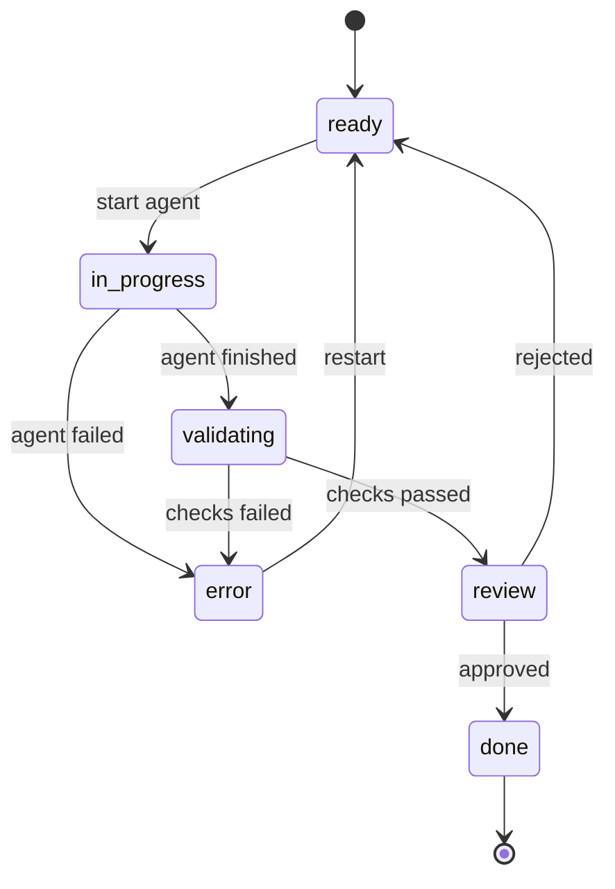

# Agent Orchestration

The agent orchestration system manages the lifecycle of AI coding agents, from spawning to review.

## Components

### Agent Session Manager

`AgentSessionManager` tracks all active Claude CLI sessions. It:

- Stores sessions indexed by session ID and task ID
- Provides output buffering for reconnection (if the browser disconnects and reconnects, it gets the buffered output)
- Handles process cleanup on shutdown
- Cleans up orphaned processes from previous server sessions

### Task Agent

The `startTaskAgent` function orchestrates starting a task:

1. Looks up the task and its metadata from the database
2. Creates a git worktree from the base branch
3. Builds the agent prompt with task description, acceptance criteria, and context
4. Spawns a Claude CLI session via `node-pty`
5. Registers output and exit handlers
6. Updates task status on completion

### Worktree Manager

Manages git worktrees for isolated agent execution:

- Creates worktrees with unique branch names
- Tracks worktree paths in the database
- Schedules garbage collection for stale worktrees
- Cleans up worktrees after tasks complete or fail

### Worktree Watcher

Uses `chokidar` to watch for file changes in active worktrees:

- Detects file additions, modifications, and deletions
- Computes diffs and streams them to connected browsers
- Stops watching when a task reaches a terminal state

### Cascade Engine

Automates task scheduling based on the dependency graph:

1. When a task changes status, the cascade engine is notified
2. It checks all tasks that depend on the completed task
3. Tasks whose dependencies are all "done" move from "blocked" to "ready"
4. If `autoStartReadyTasks` is enabled, ready tasks are started (up to `maxParallelAgents`)

The cascade engine uses a `CascadeContext` object that bundles all the dependencies it needs:

- Database connection
- Decompose ID
- Session manager
- Repo root and base ref
- Configuration (max parallel, auto-start)
- Callback functions (review policy, status broadcast)

### Review Policy

After an agent finishes, the review policy determines what happens:

| Policy | Action |
|--------|--------|
| `manual` | Task moves to "review", waits for human |
| `auto_commit` | Changes are committed to the branch automatically |
| `auto_pr` | A pull request is created automatically |

### Validation Runner

Runs automated checks on agent output before review:

- Executes validation commands (tests, lint) in the worktree
- Captures output and exit codes
- Updates validation status on the task
- Feeds failures back to the agent for retry

## Lifecycle

1. **ready**: Task is waiting to start. All dependencies are met.
2. **in-progress**: An agent is running. Terminal output is streaming.
3. **validating**: Automated checks are running on the agent's changes.
4. **review**: Agent finished. Waiting for human approval.
5. **done**: Approved. Cascade engine checks for newly unblocked tasks.
6. **error**: Something went wrong. Can be restarted manually.
