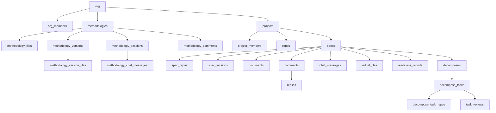

# Database Schema

The database uses SQLite with Drizzle ORM. Schema files live in `packages/db/src/schema/`, one file per table.

## Conventions

- **Primary keys**: UUID strings generated with `uuidv4()`
- **Timestamps**: SQLite integers with `{ mode: "timestamp" }`, created with `new Date()`
- **Enums**: Text columns with `{ enum: [...] }` constraint
- **Soft deletes**: `disabledAt` column where applicable
- **Foreign keys**: Text columns with `.references()` and `onDelete: "cascade"`
- **Naming**: camelCase in TypeScript, snake_case in SQL

## Entity relationship overview



## Key tables

### `decomposes`

Tracks each decompose run for a spec.

| Column | Type | Description |
|--------|------|-------------|
| `id` | text PK | UUID |
| `spec_id` | text FK | References `specs` |
| `version_number` | integer | Incrementing version |
| `content_hash` | text | SHA hash of spec content at decompose time |
| `status` | enum | running, done, error |
| `conversation_history` | text | JSON of the LLM conversation |
| `default_review_policy` | enum | manual, auto_commit, auto_pr |
| `base_ref` | text | Git branch to create worktrees from |
| `max_parallel_agents` | integer | Max concurrent agents |
| `auto_start_ready_tasks` | boolean | Auto-start when dependencies met |

### `decompose_tasks`

Individual tasks within a decompose.

| Column | Type | Description |
|--------|------|-------------|
| `id` | text PK | UUID |
| `decompose_id` | text FK | References `decomposes` |
| `task_id` | text | LLM-generated task identifier |
| `title` | text | Task title |
| `description` | text | Detailed description |
| `acceptance_criteria` | text | JSON array of criteria |
| `test_requirements` | text | JSON array of test requirements |
| `complexity` | enum | S, M, L, XL |
| `dependencies` | text | JSON array of task IDs |
| `relevant_files` | text | JSON array of file paths |
| `status` | enum | ready, blocked, in-progress, validating, review, done, error |
| `worktree_path` | text | Path to the git worktree |
| `branch_name` | text | Git branch name |
| `agent_session_id` | text | Active agent session ID |
| `review_policy` | enum | board_default, manual, auto_commit, auto_pr |
| `review_iteration` | integer | Number of review cycles |
| `agent_exit_code` | integer | CLI exit code |
| `agent_summary` | text | Agent's summary of what it did |

### `task_reviews`

Records of human review decisions.

| Column | Type | Description |
|--------|------|-------------|
| `id` | text PK | UUID |
| `decompose_task_id` | text FK | References `decompose_tasks` |
| `criteria_results` | text | JSON array of per-criterion results |
| `comments` | text | JSON array of review comments |
| `verdict` | enum | approved, rejected |
| `iteration` | integer | Which review iteration |

## Repository pattern

Each entity has a repository file in `packages/db/src/repositories/`. Repository functions are pure and take `db: DbInstance` as the first argument:

```typescript
export async function getSpecById(db: DbInstance, specId: string) {
  // ...
}

export async function createDecompose(db: DbInstance, data: {...}) {
  // ...
}
```

This makes functions easy to test with `createTestDb()` (in-memory SQLite).
