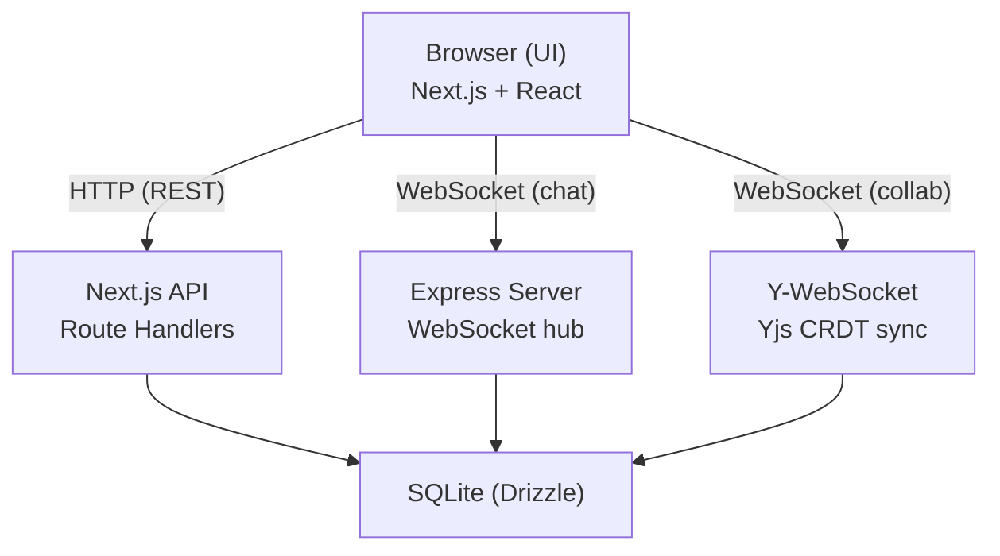

# Architecture Overview

!!! abstract "About this section"
    A deep look at how AIDLC Collaborative is built. This section covers the monorepo structure, server internals, agent orchestration, database schema, security model, and cloud infrastructure. Read this if you want to understand the system design, contribute to the codebase, or plan a production deployment.

## Packages

### `apps/spec-editor/`

The main application. Contains:

- **Next.js 16 app** with App Router for the web UI and REST API
- **Express WebSocket server** for chat, agent orchestration, and real-time features
- **React components** for the spec editor, decompose view, agent terminal, and more

### `packages/db/`

The database layer. Contains:

- **Schema definitions** (one file per table, using Drizzle ORM)
- **Repository functions** (CRUD operations, pure functions with `db` as first argument)
- **Migrations** (SQL files generated by Drizzle)
- **Test utilities** (`createTestDb()` for in-memory SQLite)

### `packages/auth/`

Authentication and authorization. Contains:

- **Provider interface** (abstract `AuthProvider` with Cognito implementation)
- **Permission resolution** (org roles, project roles, fallback logic)
- **WebSocket ticket system** (signed JWTs for WS connections)

## Data flow

### Spec editing

1. Browser opens a WebSocket to the collab server
2. Yjs CRDT syncs document state between all connected clients
3. Changes are persisted to SQLite via the Yjs persistence layer
4. Chat messages go through the Express chat WebSocket

### Decompose

1. Browser sends `decompose_start` over the chat WebSocket
2. Express server runs readiness checks, then calls the LLM
3. Tasks are streamed back as `decompose_tasks` messages
4. Tasks are persisted to the `decompose_tasks` table

### Agent execution

1. Browser sends `task_start` over the chat WebSocket
2. Express server creates a git worktree and spawns Claude CLI via `node-pty`
3. Terminal output is streamed to the browser
4. File changes are watched and diffs are streamed
5. On exit, the task moves to "review" status

Read more about each component:

- [Project Structure](project-structure.md)
- [Server](server.md)
- [Agent Orchestration](agent-orchestration.md)
- [Database Schema](database-schema.md)
- [Security](security.md)
- [Infrastructure](infrastructure.md)
