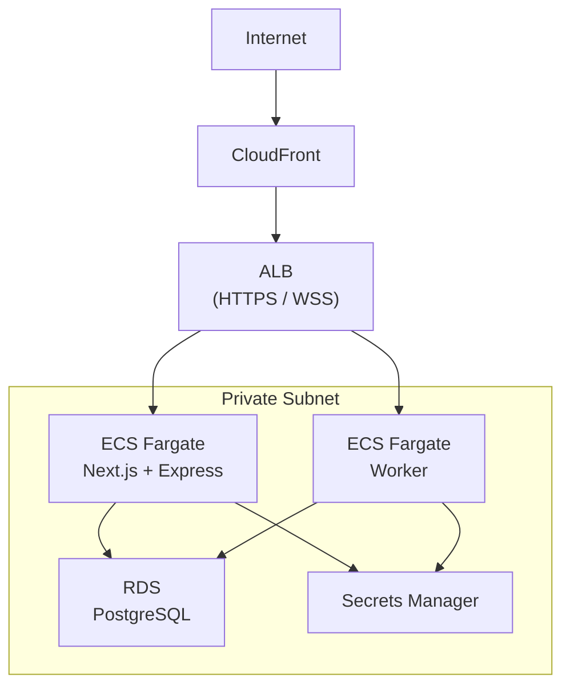

# Infrastructure

AIDLC Collaborative is designed to run locally for development and on AWS for production. The production infrastructure is defined as Terraform code.

## Local development

Locally, the stack is simple:

- Next.js dev server on port 3000
- Express WebSocket server on port 3001
- SQLite database file on disk
- No external services required (auth bypassed, LLM optional)

## Production architecture

## AWS services used

| Service | Purpose |
|---------|---------|
| **ECS Fargate** | Runs the containerized application (Next.js + Express) |
| **ALB** | Load balancer with HTTPS termination and WebSocket support |
| **CloudFront** | CDN for static assets and frontend |
| **RDS PostgreSQL** | Production database (replaces SQLite) |
| **Cognito** | User authentication and management |
| **S3** | Document storage (uploads, exports) |
| **ECR** | Docker image registry |
| **EFS** | Shared filesystem for agent worktrees |
| **Secrets Manager** | Stores sensitive configuration |
| **CloudWatch** | Logs and monitoring |
| **VPC** | Network isolation with public/private subnets |

## Terraform layout

All infrastructure is in `infra/terraform/`:

| File | What it defines |
|------|----------------|
| `main.tf` | Provider config and backend |
| `vpc.tf` | VPC, subnets, NAT gateway |
| `ecs.tf` | ECS cluster, task definitions, services |
| `alb.tf` | Application load balancer, listeners, target groups |
| `rds.tf` | PostgreSQL database instance |
| `cognito.tf` | User pool, app client, domain |
| `cloudfront.tf` | CDN distribution |
| `s3.tf` | Storage buckets |
| `ecr.tf` | Container registry |
| `efs.tf` | Elastic file system for worktrees |
| `iam.tf` | IAM roles and policies |
| `security-groups.tf` | Network access rules |
| `secrets.tf` | Secrets Manager resources |
| `cloudwatch.tf` | Log groups and alarms |
| `variables.tf` | Input variables |
| `outputs.tf` | Output values |

## Deploying

For step-by-step deployment instructions, see [Setup](../getting-started/setup.md) in the Getting Started guide.

The deployment process uses three scripts in the `scripts/` directory:

- `bootstrap.sh` — Creates the Terraform state backend (one-time setup)
- `deploy-terraform.sh` — Provisions all AWS infrastructure
- `deploy-frontend.sh` — Builds and deploys the frontend to Amazon S3 and Amazon CloudFront

## Docker

The `Dockerfile` at the root builds a production image that:

1. Installs dependencies with `npm ci`
2. Builds the Next.js app
3. Runs the application via `docker-entrypoint.sh`

The entrypoint script runs both the Next.js server and the Express WebSocket server.
