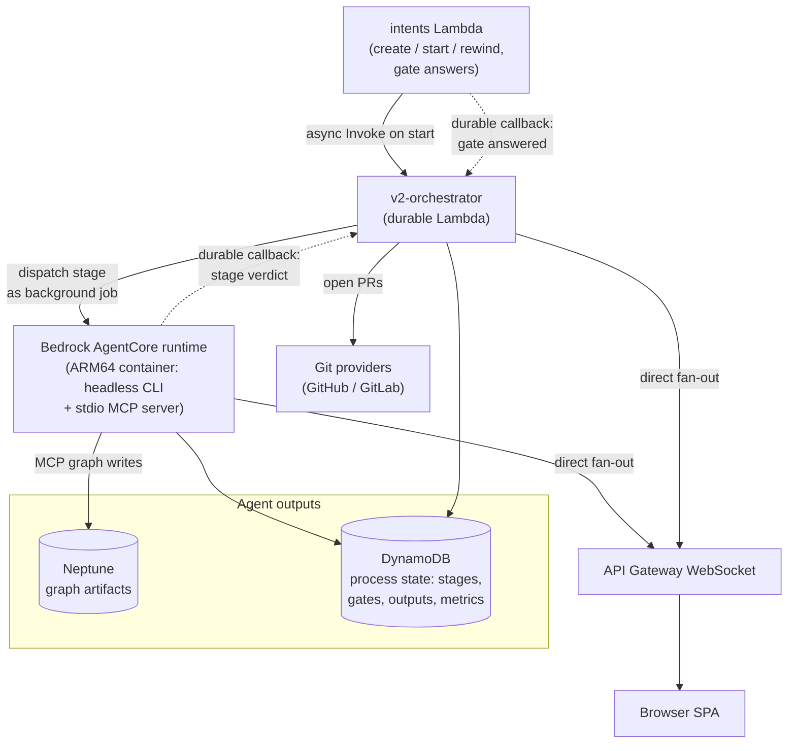

# Architecture

This page is a system-level overview of how the platform's components fit together. It is intentionally high-level — enough to orient new contributors and evaluators without descending into per-component internals.

For the founding principles and lifecycle that motivate this architecture, see [Vision](index.md). Deeper sequence diagrams for individual flows (agent invocation, OAuth handshake, WebSocket lifecycle) are intentionally out of scope here and will follow as separate documents.

The architecture is presented as two complementary top-to-bottom views:

- The **request path** — what happens when a signed-in user clicks a button in the UI.
- The **agent runtime** — what happens after the request path triggers an agent job.

Together they cover every component the platform is built from.

## Request path

The synchronous, user-facing path. From the browser down to the data stores.

### Components

**Browser.** A React 19 single-page application built with Vite. It uses AWS Amplify for Cognito SRP login, calls the REST API with the resulting JWT as a Bearer token, and opens two distinct WebSocket connections: one to the application WebSocket API for agent progress and notifications, and one to the Yjs collaboration server for real-time spec editing.

**CloudFront.** A single distribution multiplexes all client traffic over one domain. The default behavior serves the SPA from a private S3 bucket via Origin Access Control. `/api/*` routes to the REST API Gateway. `/ws` routes to the WebSocket API Gateway. `/yjs/*` routes through a CloudFront VPC Origin to an internal ALB sitting in front of the Yjs collaboration server. Routing through one distribution lets every backend share a single domain and a single TLS certificate, and keeps the SPA's API and WebSocket calls same-origin.

**Cognito User Pool.** Admin-only sign-up, optional TOTP MFA, and user groups — most importantly **`platform-admin`**, which gates the Admin page, workflow/block authoring, and user management (the legacy `member`, `approver`, `owner` groups remain for existing installs; day-to-day project access is governed by per-project membership roles). The pool issues JWTs that every backend independently verifies — the REST API Gateway uses a built-in Cognito authorizer, the WebSocket API Gateway uses a custom Lambda authorizer (because built-in Cognito authorizers don't support WebSocket APIs), and the Yjs server verifies the same token in-process on WebSocket upgrade. Cognito is not shown in the diagram to keep it readable.

**API Gateway REST.** Fronts the platform's CRUD and orchestration endpoints. Resources mirror the graph model: projects, intents, workflows, sprints, requirements, user stories, tasks, code files, reviews, questions, timeline events, plus integration endpoints for GitHub OAuth, trackers, and the agent control plane. CORS headers are injected on gateway-level 4xx/5xx responses so the SPA always sees them.

**API Gateway WebSocket.** A separate API for application-level real-time messages — agent progress, notifications, presence pings. Routes are `$connect` (custom Cognito JWT authorizer Lambda), `$disconnect`, `$default`, `sync`, and `notification`. Connection state lives in a DynamoDB table indexed by user ID and document ID; server-to-client pushes use `execute-api:ManageConnections`.

**Yjs server.** A long-running Node container on ECS Fargate that handles real-time collaborative editing of specs. It is a separate fabric from the application WebSocket API, for reasons explained below.

The Yjs server is small: on every WebSocket upgrade it pulls the Cognito JWT from the URL query string, verifies it in-process, then verifies a short-lived HMAC-signed **scope token** (issued by the discussions Lambda only to project members, bound to the caller's Cognito identity, covering exactly the requested sprint/project) before opening or joining a `Y.Doc` instance keyed by the URL path, and broadcasts CRDT sync (`type 0`) and awareness (`type 1`) updates between connected clients. Unknown document-name formats are rejected, and each socket is force-closed when its scope token expires (close code 4401) — the client reconnects with a fresh token, so membership is re-validated at most every ten minutes. A removed member can therefore keep an already-open session for at most the remaining token life. Live document state lives **only in process memory**; the server makes zero S3 or DynamoDB writes. When the last client disconnects, the doc is destroyed sixty seconds later.

This is why the Yjs server is on ECS rather than Lambda or API Gateway WebSocket: a CRDT relay needs persistent in-memory state shared across all clients editing the same document, which is incompatible with Lambda's stateless-per-invocation execution model. Internal ALB ingress is restricted to CloudFront's managed prefix list, so the server is not directly reachable from the internet.

**Realtime doc-secret rotation runbook.** The HMAC secret behind the realtime scope tokens lives in SSM Parameter Store at `/{project}/{env}/realtime-doc-secret` and is read by three consumers: the discussions Lambda (issuer), the `ws-connection` Lambda, and the Yjs ECS task. To rotate it:

1. Taint and re-apply the Terraform `random_password.realtime_doc_secret` (or write a new SecureString value directly).
2. Force new ECS deployments of the Yjs service so the task re-reads the secret (`aws ecs update-service --force-new-deployment`).
3. Publish a new version of the `ws-connection` and `discussions` Lambdas (any redeploy works — the secret is cached per container and re-fetched on cold start).
4. Expect up to ten minutes of reconnect churn: tokens signed with the old secret fail verification, clients transparently fetch fresh ones. No data is at risk — the secret only gates realtime channel membership; durable writes are independently authorized in the REST layer.

**Lambda functions.** All business logic lives in Lambda. CRUD handlers map one-to-one onto graph artifacts and write to Neptune over Gremlin with SigV4. The GitHub and tracker handlers manage OAuth flows and read repository data on behalf of users. The agent control plane (`intents`) creates, starts, and rewinds intents, answers human gates, and hands execution to the agent runtime; the `questions` Lambda serves recorded agent Q&A; the `agents` Lambda serves read-only v1 agent history plus the shared admin surface — `GET/PUT /agents/settings` (Bedrock bearer token, Kiro API key, default CLI models, all SSM-backed) and `GET /agents/capabilities` (model discovery via the AgentCore runtime). The WebSocket lifecycle Lambdas (`authorizer`, `connection`, `message`) authorize, register, and route messages on the application WebSocket API.

**Data stores.** Neptune holds the structured graph: requirements, user stories, tasks, code files, reviews, agent runs, intents and their artifacts, discussion threads and their messages, and the relationships between them. DynamoDB holds operational state — WebSocket connections, agent questions and outputs (v1 history), v2 execution process state (stages, gates, outputs, metrics), building blocks and workflows, sessions, notifications, Yjs document metadata, discussion guards/locks and per-user read cursors, and per-user OAuth connections. S3 holds the SPA bundle (frontend bucket), artifact bodies (artifacts bucket), agent code snapshots (code-snapshots bucket), and access logs.

**Not shown.** Secrets Manager stores the platform-wide OAuth app credentials for GitHub and Jira Cloud plus the optional GitHub App private key; SSM Parameter Store stores per-user GitHub access tokens (read by the GitHub Lambda when calling the GitHub API on a user's behalf), the platform-wide GitHub auth mode + App config (admin-managed at runtime), and the agent CLI authentication material. External integrations are limited to GitHub (OAuth App or GitHub App installation — an admin-switchable platform mode — used for repo access and PR creation) and Jira Cloud (OAuth 2.0, read-only). All of these have been omitted from the diagram to keep it readable; they are mentioned where relevant in the agent runtime section below.

## Agent runtime

The asynchronous path. What happens after the user starts an intent from the UI.

### Components

**Agent control plane.** The `intents` Lambda shown in diagram 1. An **intent** is the unit of agent work: a title and prompt scoped to a project. On start, the Lambda compiles the project's workflow into an execution plan, snapshots project settings, and asynchronously invokes the durable orchestrator. It also owns the human-gate answer endpoint: answering a parked gate sends a durable callback (`SendDurableExecutionCallbackSuccess`) that resumes the suspended run.

**Durable orchestrator.** `v2-orchestrator` is a Lambda-based durable execution that drives one intent end to end. It walks the plan's stages in order; parallel construction sections fan out into per-unit **lanes** over the methodology's unit-of-work DAG, scheduled deterministically (no LLM dispatcher). Stages are invoked asynchronously: the orchestrator creates a durable callback, a short dispatch call starts the stage as a background job in the AgentCore container, and the execution suspends at zero compute until the container completes the callback with the stage verdict. This matters because a stage regularly outlives both the Lambda timeout and AgentCore's synchronous request window.

**AgentCore runtime.** A Bedrock AgentCore runtime running an ARM64 container image, with a dedicated microVM and filesystem per session. Each stage spawns a headless CLI (Claude Code or Kiro, selected per project) whose only interface to the application is a stdio **MCP server**: business reads and writes go to Neptune as typed, provenance-stamped artifacts; questions, outputs, and metrics go to DynamoDB. The workspace holds the project's real git checkout, but all git operations — branch, commit, push, merge — are engine-owned and deterministic; the agent never runs git and never holds credentials. After each stage, deterministic sensors verify the output before the run advances.

**Human gates.** When an agent calls the `ask_question` MCP tool — or the orchestrator opens an engine gate (walking-skeleton review, batch review, halt-and-ask) — the run parks on a durable callback. The question renders in the UI; the user's answer flows through the `intents` Lambda, which completes the callback and resumes the run exactly where it parked. No polling, no queue.

**Pull requests.** When an execution succeeds, the orchestrator opens pull requests in-process through the shared git-provider layer (GitHub / GitLab), from the intent branch onto the base branch.

**Auth.** At container startup the runtime reads the agent CLI credentials from SSM Parameter Store — a Bedrock bearer token for Claude Code / OpenCode, or a Kiro API key — as configured in **Admin → Agents**. The runtime's IAM role deliberately has no Bedrock model-invocation permissions; token auth is the only path. Git pushes use the starting user's provider token, injected only inside the engine's push/fetch windows and scrubbed from the checkout otherwise. None of these auth lookups appear in the diagram.

**Realtime.** Every relevant process write is persisted to DynamoDB and then broadcast **directly** to the intent's WebSocket channel (`intent:<intentId>`): both the container and the orchestrator fan out through the shared connection registry. DynamoDB is the source of truth; the broadcast is best-effort and never blocks a stage. There is no event bus in this path, which is why the application WebSocket fabric exists separately from the Yjs one.

### Retired v1 runtime

Earlier releases ran agents on an ECS Fargate worker pool dispatched through a DynamoDB mailbox, with an EventBridge bus and a `notify` Lambda fanning agent events out to the browser. That runtime has been removed. v1 projects (the sprint lifecycle) are now **read-only**: no new sprints, agent runs, or edits — but their history stays viewable, including sprints, requirements, stories, tasks, code files, reviews, Q&A, agent transcripts, and discussions. The `agents` Lambda and the agent-questions / agent-outputs DynamoDB tables remain to serve that history.

## Request to review: end-to-end data flow

The two diagrams above are static. The platform's working flow takes a request from a human user through to a reviewable result in five steps.

1. **Request.** A signed-in user opens a project in the SPA and creates an **intent** with a title and prompt, then starts it. The `intents` Lambda persists the intent, compiles the workflow plan, and asynchronously invokes the durable orchestrator.
2. **Workspace.** The orchestrator's first step checks the project's repositories out into the runtime workspace, creates the `Intent` vertex in Neptune, and creates the intent branch.
3. **Stages and gates.** The orchestrator walks the plan. Each stage runs a headless CLI in the AgentCore runtime that reads prior artifacts and writes new ones to the graph through MCP; clarifying questions and approval gates park the run on durable callbacks until a human answers in the UI, then the run resumes where it left off.
4. **Parallel construction.** Construction stages fan out into per-unit lanes: each lane runs in its own AgentCore session on its own branch, deterministic sensors verify every stage, and the engine merges completed lanes back into the intent branch with serialized `--no-ff` merges. Progress streams to the browser over the direct WebSocket fan-out throughout.
5. **Output and review.** When the execution succeeds, the orchestrator opens a pull request from the intent branch onto the base branch via the shared git providers. Humans review the PR alongside the intent's artifacts, outputs, and metrics in the UI.
