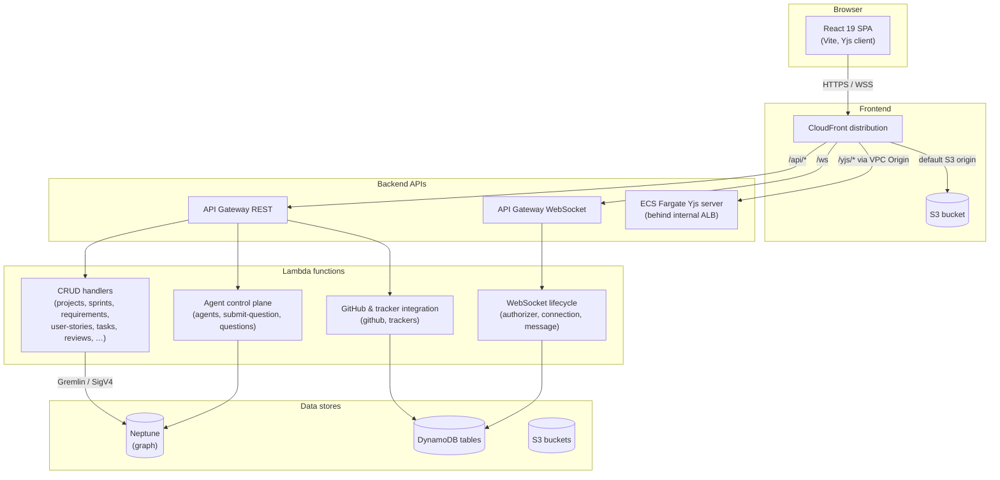
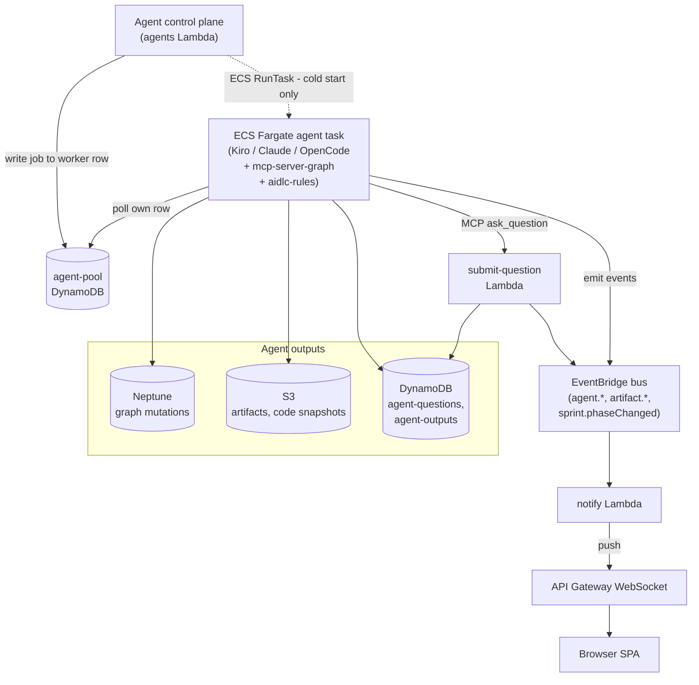

# Architecture

This page is a system-level overview of how the platform's components fit together. It is intentionally high-level — enough to orient new contributors and evaluators without descending into per-component internals.

For the founding principles and lifecycle that motivate this architecture, see [Vision](index.md). Deeper sequence diagrams for individual flows (agent invocation, OAuth handshake, WebSocket lifecycle) are intentionally out of scope here and will follow as separate documents.

The architecture is presented as two complementary top-to-bottom views:

- The **request path** — what happens when a signed-in user clicks a button in the UI.
- The **agent runtime** — what happens after the request path triggers an agent job.

Together they cover every component the platform is built from.

## Request path

The synchronous, user-facing path. From the browser down to the data stores.

### Components

**Browser.** A React 19 single-page application built with Vite. It uses AWS Amplify for Cognito SRP login, calls the REST API with the resulting JWT as a Bearer token, and opens two distinct WebSocket connections: one to the application WebSocket API for agent progress and notifications, and one to the Yjs collaboration server for real-time spec editing.

**CloudFront.** A single distribution multiplexes all client traffic over one domain. The default behavior serves the SPA from a private S3 bucket via Origin Access Control. `/api/*` routes to the REST API Gateway. `/ws` routes to the WebSocket API Gateway. `/yjs/*` routes through a CloudFront VPC Origin to an internal ALB sitting in front of the Yjs collaboration server. Routing through one distribution lets every backend share a single domain and a single TLS certificate, and keeps the SPA's API and WebSocket calls same-origin.

**Cognito User Pool.** Admin-only sign-up, optional TOTP MFA, and three groups (`member`, `approver`, `owner`). The pool issues JWTs that every backend independently verifies — the REST API Gateway uses a built-in Cognito authorizer, the WebSocket API Gateway uses a custom Lambda authorizer (because built-in Cognito authorizers don't support WebSocket APIs), and the Yjs server verifies the same token in-process on WebSocket upgrade. Cognito is not shown in the diagram to keep it readable.

**API Gateway REST.** Fronts the platform's CRUD and orchestration endpoints. Resources mirror the graph model: projects, sprints, requirements, user stories, tasks, code files, reviews, questions, timeline events, plus integration endpoints for GitHub OAuth, trackers, and the agent control plane. CORS headers are injected on gateway-level 4xx/5xx responses so the SPA always sees them.

**API Gateway WebSocket.** A separate API for application-level real-time messages — agent progress, notifications, presence pings. Routes are `$connect` (custom Cognito JWT authorizer Lambda), `$disconnect`, `$default`, `sync`, and `notification`. Connection state lives in a DynamoDB table indexed by user ID and document ID; server-to-client pushes use `execute-api:ManageConnections`.

**Yjs server.** A long-running Node container on ECS Fargate that handles real-time collaborative editing of specs. It is a separate fabric from the application WebSocket API, for reasons explained below.

The Yjs server is small: on every WebSocket upgrade it pulls the Cognito JWT from the URL query string, verifies it in-process, then verifies a short-lived HMAC-signed **scope token** (issued by the discussions Lambda only to project members, bound to the caller's Cognito identity, covering exactly the requested sprint/project) before opening or joining a `Y.Doc` instance keyed by the URL path, and broadcasts CRDT sync (`type 0`) and awareness (`type 1`) updates between connected clients. Unknown document-name formats are rejected, and each socket is force-closed when its scope token expires (close code 4401) — the client reconnects with a fresh token, so membership is re-validated at most every ten minutes. A removed member can therefore keep an already-open session for at most the remaining token life. Live document state lives **only in process memory**; the server makes zero S3 or DynamoDB writes. When the last client disconnects, the doc is destroyed sixty seconds later.

This is why the Yjs server is on ECS rather than Lambda or API Gateway WebSocket: a CRDT relay needs persistent in-memory state shared across all clients editing the same document, which is incompatible with Lambda's stateless-per-invocation execution model. Internal ALB ingress is restricted to CloudFront's managed prefix list, so the server is not directly reachable from the internet.

**Lambda functions.** All business logic lives in Lambda. CRUD handlers map one-to-one onto graph artifacts and write to Neptune over Gremlin with SigV4. The GitHub and tracker handlers manage OAuth flows and read repository data on behalf of users. The agent control plane (`agents`, `submit-question`, `questions`) dispatches work to the agent runtime and brokers human-in-the-loop questions. The WebSocket lifecycle Lambdas (`authorizer`, `connection`, `message`) authorize, register, and route messages on the application WebSocket API.

**Data stores.** Neptune holds the structured graph: requirements, user stories, tasks, code files, reviews, agent runs, discussion threads and their messages, and the relationships between them. DynamoDB holds operational state — WebSocket connections, agent questions and outputs, the agent-worker pool, sessions, notifications, Yjs document metadata, discussion guards/locks and per-user read cursors, and per-user OAuth connections. S3 holds the SPA bundle (frontend bucket), artifact bodies (artifacts bucket), agent code snapshots (code-snapshots bucket), and access logs.

**Not shown.** Secrets Manager stores the platform-wide OAuth app credentials for GitHub and Jira Cloud; SSM Parameter Store stores per-user GitHub access tokens (read by the GitHub Lambda when calling the GitHub API on a user's behalf) and the agent CLI authentication material. External integrations are limited to GitHub (OAuth App, used for repo access and PR creation) and Jira Cloud (OAuth 2.0, read-only). All of these have been omitted from the diagram to keep it readable; they are mentioned where relevant in the agent runtime section below.

## Agent runtime

The asynchronous path. What happens after the user starts an agent job from the UI.

### Components

**Agent control plane.** The same `agents` Lambda shown in diagram 1. It handles `POST /projects/{id}/agents` and dispatches the job to the agent runtime. It does this in one of two ways:

- **Cold start.** When no idle worker is found, it calls ECS `RunTask` to launch a fresh Fargate task and pre-writes a row for it in the pool table with the job payload.
- **Idle worker reuse (hot path).** It queries the `agent-pool` DynamoDB table for an idle worker advertising the project's CLI, then conditionally writes `status='assigned'` and the job payload onto that worker's row. No ECS API call is made — the Fargate task already exists.

**Pool model.** Each Fargate task is a long-lived "pool worker" that loops forever doing a DynamoDB `GetItem` on its own pool row. When it sees `status='assigned'` and a `job` field, it picks up the job. When it sees `status='draining'` or the row has been deleted, it exits cleanly. The DynamoDB row is therefore a **mailbox**, not an event source: nothing about DynamoDB triggers Fargate. The dispatch protocol is "control plane writes the row, worker polls it."

This pattern avoids paying the cold-start cost of ECS task launch (~30 seconds in practice) on every agent invocation, at the cost of running idle workers between jobs. The hot path resolves a job dispatch in a single DynamoDB conditional write.

**Agent task.** ECS Fargate task whose image bundles three pluggable CLIs — Kiro CLI, Claude Agent ACP, OpenCode — plus a custom Neptune-backed `mcp-server-graph` MCP server and the AI-DLC workflow rules under `/opt/aidlc-rules/`. The CLI used for a given job is selected per-project. ECS rather than Lambda because agent runs are long-lived (often many minutes), interactive (the agent can pause to ask the user a question), and need a working filesystem.

**MCP graph server.** Bundled into the agent image. Exposes typed graph tools (create requirement, link user story to requirement, attach code file to task, etc.) so the agent reads and mutates Neptune through MCP rather than writing raw Gremlin. The same MCP server exposes the `ask_question` tool, which when called invokes the `submit-question` Lambda directly via `lambda:Invoke` to record the question in the `agent-questions` DynamoDB table and emit an `agent.question` event onto the bus.

**Auth.** The agent reads its CLI authentication material from SSM Parameter Store: a Bedrock bearer token for Claude/OpenCode, a Kiro API key for the Kiro CLI, and an MCP server config blob. When pushing code, it reads the user's GitHub access token from a separate per-user SSM path. None of these auth lookups appear in the diagram.

**EventBridge and `notify`.** A dedicated EventBridge bus carries `agent.*`, `artifact.*`, and `sprint.phaseChanged` events emitted by the running agent and by `submit-question`. The `notify` Lambda is the sole target on every rule; it queries the WebSocket connection registry in DynamoDB and pushes events to subscribed clients. This is how every running agent's progress reaches the user's browser in real time, and why the application WebSocket fabric exists separately from the Yjs one.

## Request to review: end-to-end data flow

The two diagrams above are static. The platform's working flow takes a request from a human user through to a reviewable result in five steps.

1. **Request.** A signed-in user opens a project in the SPA and starts a new sprint with a description. The SPA writes the sprint via `POST /api/sprints`, which the REST Lambda persists as a `Sprint` vertex in Neptune.
2. **Spec.** The user starts the Inception agent. The frontend calls `POST /api/projects/{id}/agents`; the agent control plane assigns the job to an idle pool worker (or launches one) and the agent reads the sprint description, asks clarifying questions through the `submit-question` path when needed, and writes structured `Requirement`, `UserStory`, and `Task` vertices into the graph. Real-time edits to those artifacts use the Yjs collaboration fabric, so multiple humans can refine the spec simultaneously.
3. **Agent run.** When the user moves the sprint into Construction, the agent control plane dispatches one or more agent jobs to the pool. Each agent works in an isolated workspace, mutates the graph through MCP, streams `agent.*` events to EventBridge, and writes code artifacts to the `code-snapshots` S3 bucket and `CodeFile` vertices to Neptune.
4. **Output.** Agent progress is fanned out to the user's browser through EventBridge → `notify` → the WebSocket API → the SPA. Final structured outputs land in DynamoDB and Neptune, and any code is pushed to a sprint branch using the user's GitHub token from SSM.
5. **Review.** In the Review phase, review agents are dispatched the same way as construction agents. Their findings are written back to the graph as `Review` vertices linked to the requirements they evaluated. Humans add comments, then either approve the sprint or send it back to Construction with structured feedback. Either decision is a graph mutation that triggers a `sprint.phaseChanged` event and updates every connected client in real time.
