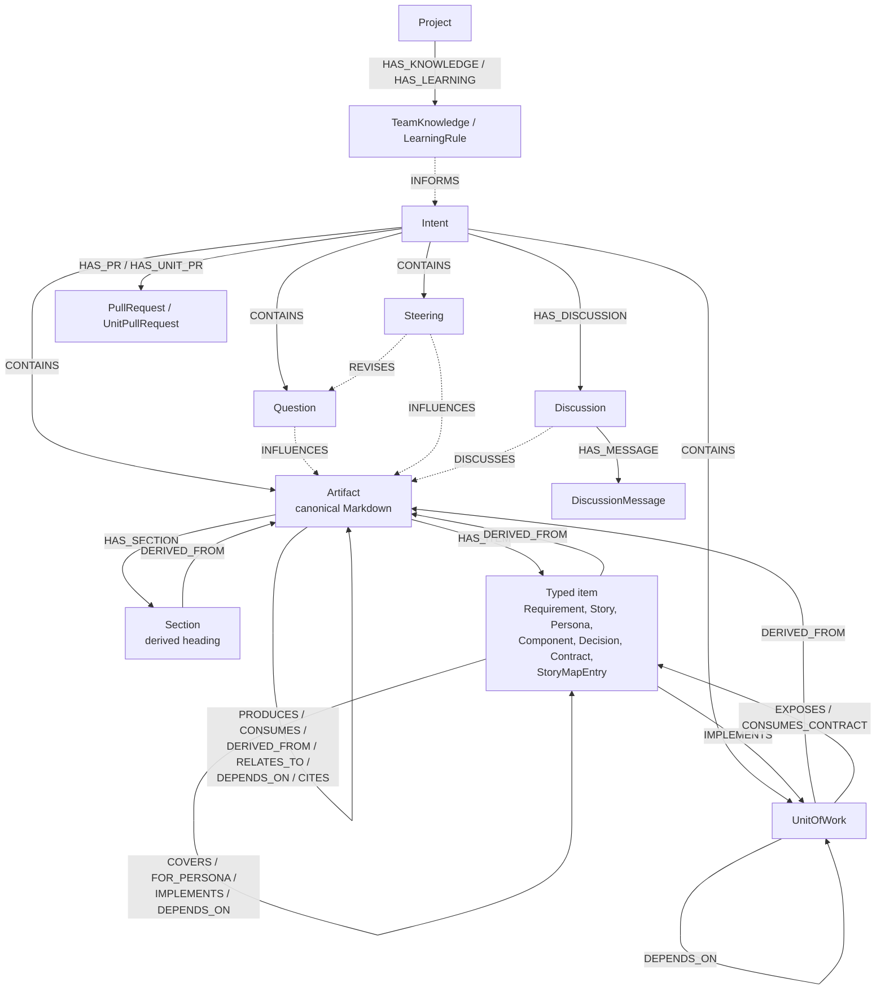
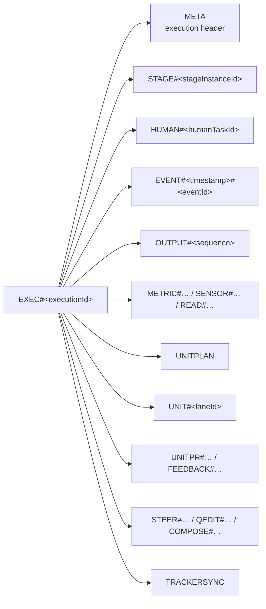

# Data model

The platform has three core persistence models:

- The **Neptune knowledge graph** holds durable development knowledge and
  traceability: requirements, decisions, artifacts, derived items, provenance,
  and their relationships.
- The **DynamoDB execution model** holds the operational state of an intent run:
  stages, gates, events, outputs, metrics, construction lanes, and integration
  waits.
- The **DynamoDB blocks and workflows model** holds the versioned methodology
  library and executable workflow compositions.

These models have different responsibilities. DynamoDB is the source of truth
for orchestration and scheduling; Neptune is the source of truth for the
knowledge and traceability agents consume. The methodology library supplies the
pinned workflow and blocks used to construct each execution plan.

Earlier releases used a sprint-scoped graph and separate agent execution
tables. That v1 model is read-only and is not the normative model described
here.

## Neptune knowledge graph

The graph keeps a requirement, the decision behind it, the work that implements
it, and the resulting pull request connected. The canonical artifact is its
authored Markdown document. Sections, typed items, citations, and their
traceability edges are derived projections that can be rebuilt
deterministically.

### Conceptual model



The diagram is intentionally conceptual. Some relationships can target more
than one entity type, and the Graph page omits section vertices to keep the
visual topology readable.

### Graph layers

#### Artifact layer

The artifact layer contains the intent, its canonical documents, human input,
provenance, discussions, knowledge, and delivery records. It is the compact
default shown on the Graph page.

Agents may create relationships between artifacts only from the explicit
business-edge allowlist. They cannot invent arbitrary edge labels.

#### Derived item layer

After an artifact is written, deterministic parsers inspect its Markdown:

1. Markdown H2–H6 headings become `Section` vertices; H1 is excluded.
2. Registered fenced-YAML blocks become typed item vertices.
3. `[[artifact-type]]` references create `CITES` edges to matching artifacts.
4. Relationship fields such as `covers`, `persona`, and `depends_on` become
   typed edges.
5. The execution unit plan is mirrored as `UnitOfWork` vertices and edges.

Agents write documents and structured blocks, not graph topology. The derived
layer is an index over those documents and can be regenerated.

### Vertex types

#### Scope and authored knowledge

| Vertex | Scope | Purpose |
| --- | --- | --- |
| `Project` | Platform | Membership and the shared knowledge boundary. |
| `Intent` | Project | Anchor for one unit of requested agent work. |
| `Artifact` | Intent | Canonical Markdown output produced by a stage. |
| `ArtifactVersion` | Artifact | Immutable history for a logical artifact head. |
| `Question` | Intent | Agent question, structured answer, and answering provenance. |
| `Steering` | Intent | Human course correction, revision, or redirect. |
| `Discussion` | Intent/entity | Thread attached to an entity in the intent graph. |
| `DiscussionMessage` | Discussion | Durable message in a discussion thread. |
| `PullRequest` | Intent | Final intent-level pull request. |
| `UnitPullRequest` | Intent/unit | Pull request produced by an individual construction lane. |
| `TeamKnowledge` | Project | Reusable knowledge injected into relevant agent runs. |
| `LearningRule` | Project | Reusable team or project learning guardrail. |

#### Derived structure

| Vertex | Derived from | Important fields |
| --- | --- | --- |
| `Section` | Markdown heading | `slug`, heading level, order, line range, content hash |
| `Requirement` | `requirements` block | category, priority, description, acceptance criteria |
| `Story` | `stories` block | persona, priority, covered requirements, dependencies, acceptance criteria |
| `Persona` | `personas` block | role, goals, pain points |
| `Component` | `components` block | description, responsibilities, dependencies |
| `Decision` | `decisions` block | status, context, decision, consequences |
| `StoryMapEntry` | `mappings` block | unit and delivered stories |
| `Contract` | `contracts` block | provider, consumers, kind, description |
| `UnitOfWork` | Compiled unit plan | stable unit slug and execution provenance |

The typed-item list and field definitions come from the extraction registry in
`lambda/shared/artifact-extractors.js`. That registry is the implementation
source of truth: adding a registered type automatically extends extraction,
validation, agent authoring instructions, and graph reads.

### Edge types

#### Scope and ownership

| Edge | Meaning |
| --- | --- |
| `CONTAINS` | A scope owns an entity, most commonly an intent owning artifacts, questions, steering, and units. |
| `HAS_SECTION` | An artifact contains a derived Markdown section. |
| `HAS_ITEM` | An artifact contains a derived typed item. |
| `HAS_DISCUSSION` | An intent or entity has an attached discussion. |
| `HAS_MESSAGE` | A discussion contains a durable message. |
| `HAS_PR` | An intent produced a final pull request. |
| `HAS_UNIT_PR` | An intent produced a unit-level pull request. |
| `HAS_KNOWLEDGE` | A project owns reusable team knowledge. |
| `HAS_LEARNING` | A project owns a reusable learning rule. |
| `HAS_VERSION` | A logical artifact head retains an immutable historical version. |

#### Artifact relationships

| Edge | Meaning |
| --- | --- |
| `PRODUCES` | One artifact or stage output produces another. |
| `CONSUMES` | An artifact consumes another artifact as input. |
| `DERIVED_FROM` | An artifact was derived from another artifact, or a section, item, or unit was derived from its source artifact. |
| `RELATES_TO` | A durable semantic association that is more specific than shared scope but has no stronger edge type. |
| `DEPENDS_ON` | The source cannot be understood or delivered independently of the target. |
| `CITES` | An artifact explicitly references another artifact by its artifact type. |

#### Traceability and provenance

| Source | Edge | Target |
| --- | --- | --- |
| `Story` | `COVERS` | `Requirement` |
| `Story` | `FOR_PERSONA` | `Persona` |
| `StoryMapEntry` | `IMPLEMENTS` | `Story` or `UnitOfWork` |
| `Story`, `Component`, or `UnitOfWork` | `DEPENDS_ON` | Another entity of the same type |
| `UnitOfWork` | `EXPOSES` | `Contract` |
| `UnitOfWork` | `CONSUMES_CONTRACT` | `Contract` |
| Answered `Question` or `Steering` | `INFLUENCES` | Resulting `Artifact` |
| `Steering` | `REVISES` | Revised `Question` |
| `Discussion` | `DISCUSSES` | Attached entity |
| `TeamKnowledge` or `LearningRule` | `INFORMS` | `Intent` |

`INFORMS` is synthesized in the graph API projection to show prompt injection;
Neptune persists the knowledge vertices under `Project` through `HAS_KNOWLEDGE`
and `HAS_LEARNING`.

### Identity, provenance, and lifecycle

Every intent-scoped write carries trusted provenance rather than relying on
agent-supplied metadata. Common fields include:

- `project_id` and `intent_id`
- `created_by_execution_id` and `created_by_stage_instance_id`
- `section_index` and `unit_slug` for parallel construction lanes
- `stage_attempt`
- `created_at`

Artifact IDs are chosen by agents and are only unique within an intent.
Artifact and section lookups are therefore always scoped by `intent_id`.
Derived item IDs include their intent and type, while questions, steering, and
other operational vertices use globally unique or deterministic IDs.

A logical artifact keeps a stable current head. Rewinds and edits preserve
history:

- `ArtifactVersion` records immutable prior content.
- `superseded_at` and `superseded_by` mark lineage without deleting history.
- Normal graph, context, and search reads expose only current logical heads.
- Re-running a stage can rehabilitate a superseded logical artifact while
  retaining its lineage.

### What the Graph page shows

The Graph page is a projection of the stored model, not a raw database browser.
It:

- defaults to artifacts and provenance;
- optionally adds typed items and units;
- excludes `Section` nodes to avoid overwhelming the canvas;
- excludes superseded or stale derived rows from normal views;
- drops edges whose endpoints are outside the rendered intent subgraph.

For the runtime behavior that creates and consumes this graph, see the
[execution model](execution.md#the-artifact-graph). For the UI, see
[The graph page](../using-the-platform/intent-observability.md#the-graph-page).

## DynamoDB execution model

The v2 executions table is the durable process model for intent execution. It
answers operational questions that do not belong in the knowledge graph:

- What state is the execution or a stage in?
- Which human gate is waiting for an answer?
- Which construction lanes are ready, running, blocked, or complete?
- What output, metrics, sensor results, and graph reads did a stage produce?
- Which pull-request or tracker operation must be checked again?

The table uses a composite-key single-table design. Every record for one run is
grouped in the same partition:

```text
pk = EXEC#<executionId>
```

The sort key identifies the record type and, where ordering matters, includes a
timestamp or sequence:



### Record types

| Sort-key pattern | Record | Purpose |
| --- | --- | --- |
| `META` | Execution | Captured intent and workflow configuration, overall status, timestamps, and repository context. |
| `STAGE#<stageInstanceId>` | Stage | State and attempts for one concrete stage invocation, including a unit-specific stage. |
| `EVENT#<timestamp>#<eventId>` | Event | Ordered execution timeline and audit event. |
| `HUMAN#<humanTaskId>` | Human task | A suspended human gate, its callback, answer, and resolution state. |
| `OUTPUT#<sequence>` | Output | Ordered agent-output chunk; the zero-padded sequence preserves emission order. |
| `METRIC#<timestamp>#<metricId>` | Metric | Token, cost, duration, or other collected execution metric. |
| `SENSOR#<timestamp>#<sensorRunId>` | Sensor run | Deterministic post-stage validation result. |
| `READ#<timestamp>#<readId>` | Graph read | Audit record of context read from the knowledge graph. |
| `STEER#<timestamp>#<steerId>` | Steering | Pending or consumed human course correction, ordered by creation time. |
| `UNITPLAN` | Unit plan | Current scheduling snapshot for the construction unit DAG. |
| `UNIT#<laneId>` | Unit | Scheduling state for one construction lane, including dependencies, branch, and session. |
| `UNITPR#<laneId>#<repository>` | Unit pull request | Pull-request lifecycle for one unit and repository. |
| `FEEDBACK#<laneId>#<batchId>` | Feedback batch | A queued or completed batch of review feedback for a unit. |
| `FEEDBACKCOMMENT#<laneId>#<comment>` | Feedback comment | Stable per-comment state within unit feedback processing. |
| `QEDIT#<editId>` | Quorum edit | Post-hoc artifact edit plan, approval callback, and apply outcome. |
| `COMPOSE#<composeId>` | Compose request | Adaptive-workflow proposal and its validation result. |
| `TRACKERSYNC` | Tracker sync | Current external-tracker synchronization state and next check. |

`UNITPLAN` and `UNIT#…` rows are the scheduling source of truth. Their
`UnitOfWork` representation in Neptune is a traceability and UI projection; the
orchestrator never schedules work from the graph.

### Indexes and access patterns

The table has three global secondary indexes:

| Index | Key pattern | Access pattern |
| --- | --- | --- |
| `GSI1` | `PROJECT#<projectId>` / `STATUS#<status>#STARTED#<timestamp>#EXEC#<executionId>` | List a project's executions by status and start time. |
| `GSI2` | `EXEC#<executionId>` / `TYPE#<type>#STATE#<state>#<id>` | Find records of one type and state within an execution, such as pending human gates or ready units. |
| `GSI3` | Sparse operational keys | Find cross-execution maintenance work without scanning the table. |

`GSI3` currently groups three kinds of live work:

| Partition value | Purpose |
| --- | --- |
| `ACTIVE_EXECUTIONS` | Executions that may require recovery or continuation. |
| `PR_WAITS` | Unit pull requests parked while waiting for an external condition. |
| `TRACKER_SYNCS` | Tracker synchronizations ordered by their next scheduled check. |

### Relationship to the graph

The execution and graph models are joined by stable application identifiers,
not by database-level foreign keys:

| Identifier | DynamoDB role | Neptune role |
| --- | --- | --- |
| `projectId` | Project execution index and captured configuration. | Project scope, membership, knowledge, and learnings. |
| `intentId` | Associates the execution header with the user's intent. | Anchors the intent knowledge subgraph. |
| `executionId` | Owns the execution-table partition. | Provenance field on artifacts created by that run. |
| `stageInstanceId` | Identifies a stage row and its callbacks, output, and metrics. | Provenance field on artifacts produced by the stage. |
| `sectionIndex` and `unitSlug` | Identify parallel construction lanes. | Identify the corresponding derived units and artifact provenance. |

An intent can have a DynamoDB `META` row while it is still a draft and before
its Neptune `Intent` vertex exists. Starting the intent creates the graph
anchor; subsequent stages update process state in DynamoDB and write knowledge
artifacts to Neptune.

### Lifecycle characteristics

Different records have different update behavior:

- Execution, stage, human-task, unit, pull-request, and synchronization rows are
  updated as their state machines advance.
- Events, outputs, metrics, sensor results, and graph-read records form ordered
  execution history.
- Rewinds reset the affected executable state while preserving audit context
  through events, steering, attempts, and graph lineage.
- Durable callbacks are stored with waiting work so an execution can suspend
  without consuming compute and resume from the same point.

The key builders and record constructors in
`lambda/shared/v2-process-keys.js` are the implementation source of truth. The
read/write behavior is centralized in `lambda/shared/v2-process-store.js`.

## DynamoDB blocks and workflows model

Building blocks and workflows share one composite-key DynamoDB table. Blocks
occupy one partition per reusable definition; workflows occupy one partition
per composition.

### Building blocks

```text
pk = BLOCK#<tenant>#<TYPE>#<id>
sk = V#latest | V#<version>
```

`V#latest` is the mutable current record. Each numbered `V#<version>` record is
an immutable snapshot. The catalog index lists the current blocks of one type:

```text
GSI1PK = TENANT#<tenant>#<TYPE>
GSI1SK = <name>
```

Large Markdown bodies and sensor scripts are stored content-addressed in S3.
The DynamoDB record carries `bodyRef` and `scriptRef` pointers containing the S3
key, SHA-256 hash, and byte count.

### Workflows

```text
pk = WF#<tenant>#<workflowId>
```

One partition contains the complete live composition:

| Sort-key pattern | Record |
| --- | --- |
| `META` | Workflow header and current version. |
| `PHASE#<path>#<phaseId>` | Ordered, nestable inline phase. |
| `PLACEMENT#<stageId>` | Stage placement and scope membership. |
| `SCOPEREF#<scopeId>` | Scope available to the workflow. |
| `RULEREF#<layer>#<id>` | Rule attached at a workflow rule layer. |

Every workflow mutation creates an immutable snapshot by copying the live rows
under `V#<version>#<live-sort-key>`. A single partition query therefore loads
either the current composition or an exact historical version. The `META` row
uses the catalog index key `TENANT#<tenant>#WORKFLOW`.

### Ownership and execution

The table has two ownership namespaces:

- `SYSTEM` contains the read-only imported baseline.
- `default` contains user-created and forked definitions.

A `default` definition shadows the `SYSTEM` definition with the same identifier.
When an intent starts, its execution metadata pins a numbered workflow version,
so later workflow edits cannot change the running plan.

The key schemes in `lambda/shared/blocks.js` and
`lambda/shared/workflows.js` are the implementation sources of truth.

For the surrounding AWS components and other storage services, see
[Architecture](architecture.md).
