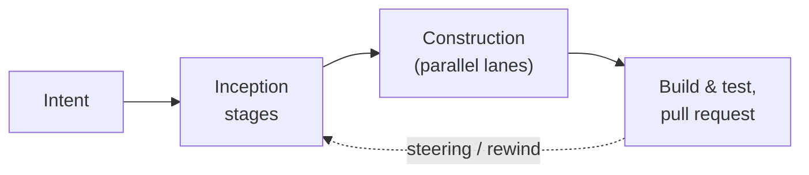

# Vision

Software development is increasingly a collaboration between humans and AI agents. But most tools treat agents as isolated code generators that receive a prompt and return code. They miss the bigger picture: how do you go from a business idea to production software when AI is involved? How do you keep traceability between what was intended and what was built? How do you prevent agents from losing context as scope grows?

AIDLC Collaborative answers these questions with an opinionated workflow built on principles that outlast any single tool or technology.

## Core principles

### Structured data as the backbone

Requirements, user stories, tasks, interactions (questions/answers between humans and agents), and code files live in a graph database. The link between what was intended and what was implemented is never lost. When a requirement changes, you can trace exactly what downstream work is affected.

**Why structured data instead of large context windows?** Traditional AI coding tools rely on feeding entire codebases into massive context windows (200k+ tokens) and letting transformer attention mechanisms find relevant connections. This works for small projects but breaks down at scale: context gets diluted, irrelevant information competes for attention, and the model loses track of what matters.

By storing artifacts in a structured database with explicit relationships (requirement → user story → task → code file → review comment), we give agents exactly the context they need — no more, no less. Token usage stays bounded and agents don't waste cycles exploring irrelevant code paths.

This also opens the door to supplementary approaches: vector databases for general codebase semantic search, while the graph database handles the structured relationships specific to the human/agent software development process (inception, construction, review, operation).

### Traceability

The graph database enables full traceability across the development lifecycle. Every artifact is connected:

- A business requirement links to the user stories that describe it
- User stories link to the tasks that implement them
- Tasks link to the code files produced
- Review comments link back to the requirements they evaluate

This means you can answer questions like: "Which code implements requirement X?", "What requirements are affected if I change this module?", "Who approved this change and when?"

Beyond the graph, the NoSQL layer (DynamoDB) tracks operational state: task status, agent execution history, ownership, timestamps. Together, they give humans complete visibility into what happened, why, and by whom — human or agent.

### Human observability

The workflow has clear phases where humans approve, redirect, or refine. But observability is more than just approval gates.

**The key insight:** abstract away the noise of each agent's raw output and surface only the high-level, business-relevant information. An agent might produce thousands of lines of terminal output, dozens of file changes, and multiple intermediate reasoning steps. The human reviewer doesn't need all of that. They need: "What was built? Does it meet the requirements? What are the risks?"

This is fundamentally about respecting the human's "context window" — their brain has limited bandwidth too. The platform structures agent output into digestible summaries, structured reviews, and clear pass/fail decisions so humans can make informed judgments without drowning in noise.

### Real-time collaboration

Most AI coding tools today are local and individual. They excel at personal productivity: a developer and an AI pair-programming in a single IDE. But enterprise software development is inherently collaborative. Teams need:

- Shared state that everyone can see and edit simultaneously
- Multiple agents working on different tasks in parallel
- Visibility into what others (humans and agents) are doing
- No manual syncing of markdown files, skill configs, or local state

AIDLC Collaborative is collaborative-first. Intent progress, artifacts, gates, and discussions stream to every project member in real time; presence and shared editing run over Yjs CRDT. Multiple agents execute concurrently. All state lives in shared infrastructure, not on individual machines.

### Tool-agnostic architecture

The platform is not locked into any single technology. We integrate what works best for each module:

- **Agent compute:** Currently the Amazon Bedrock AgentCore runtime (serverless, one isolated session per agent). Could be container-based (ECS) or other serverless agent runtimes.
- **Structured data:** Currently Neptune (graph DB) + DynamoDB. Could be other graph engines (Neo4j, etc.) or supplemented with vector databases for semantic search.
- **Agent tooling:** Integrates with Claude Code, OpenCode, Kiro, and other adopted tools rather than replacing them.
- **Source control:** GitHub and GitLab today, with other providers possible through the shared git-provider layer.

The important thing is the _concept_ at each layer — structured data, traceability, collaboration, observability — not the specific implementation. Tools evolve fast; these principles don't.

For a visual overview of how these layers fit together in the current implementation, see the [architecture diagram](architecture.md).

## The lifecycle

Work is organized around **intents**. An intent is the unit of agent work: a title and a prompt scoped to a project. Starting an intent executes a **workflow** — an ordered plan of stages, grouped into phases, composed from a library of methodology building blocks.

The default `aidlc-v2` workflow follows the AI-DLC methodology's progression:

| Phase group      | Purpose                                | Output                                                      |
| ---------------- | -------------------------------------- | ----------------------------------------------------------- |
| **Inception**    | Define what to build, remove ambiguity | Requirements, user stories, personas, units of work         |
| **Construction** | Build it, one lane per unit of work    | Designs, decisions, and code on per-unit branches           |
| **Delivery**     | Integrate and verify                   | Merged intent branch, build and test results, pull request  |

Every stage is verified three ways before the run advances: deterministic **sensors**, an LLM-judged **reviewer** agent, and **human validation gates**. When work needs redirecting, you steer the run with course corrections or rewind it to an earlier stage — an iterative loop without restarting from scratch.

## Intents

An intent can be one feature, one issue, or a whole project scope. It can vary in size — the methodology adapts the number of units of work depending on the scope: a small bug fix might produce 2-3 units; a greenfield project might produce 30+. The intent's **scope** (feature, bugfix, greenfield, …) decides which workflow stages actually execute.

Each intent tracks:

- Its lifecycle state (`DRAFT → CREATED → RUNNING → WAITING → SUCCEEDED | FAILED | CANCELLED`)
- The prompt that scopes the work (optionally seeded from a tracker issue)
- The pinned workflow version and scope it executes under
- The intent branch and per-repository base branches
- Per-stage execution state, human gates, artifacts, metrics, and cost

You start an intent by writing a prompt (or importing a tracker issue), reviewing the draft, and clicking start. See [Creating intents](../using-the-platform/creating-intents.md).

!!! note "Retired v1 lifecycle"

    Earlier releases organized work around **sprints** with a fixed Inception → Construction → Review pipeline running on an ECS worker pool. That runtime has been removed; v1 projects are read-only — their history stays viewable, but new sprints and v1 agent runs can no longer be started. All new work runs as v2 intents on the Bedrock AgentCore runtime.

Read about how it works in detail:

- [Architecture](architecture.md) — system-level component overview
- [Workflows and building blocks](workflows-and-blocks.md) — how the methodology is composed
- [Execution model](execution.md) — how an intent runs, from orchestration to pull request
