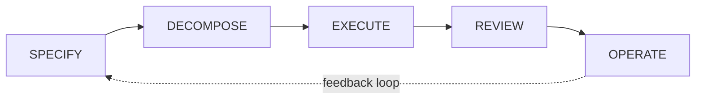

# The Pipeline

!!! abstract "About this section"
    This section explains the core mental model behind AIDLC Collaborative: a five-stage pipeline that takes software from idea to production. Each stage has a clear contract, producing structured output that feeds into the next one. Understanding these stages is key to using the platform effectively.

## Stage contracts

Each stage has a clear input and output:

| Stage | Input | Output |
|-------|-------|--------|
| **Specify** | Ideas, requirements, discussions | A complete spec document |
| **Decompose** | A spec document | A DAG of implementation tasks |
| **Execute** | A task with context | Code changes in a branch |
| **Review** | A branch with changes | Approved or rejected with feedback |
| **Operate** | Deployed software | Monitoring insights that feed back into specs |

## Current status

| Stage | Status |
|-------|--------|
| Specify | Working |
| Decompose | Working |
| Execute | Working |
| Review | Working |
| Operate | Planned |

## How the stages connect

The pipeline is not strictly linear. Several feedback loops exist:

- A **review rejection** sends the task back to Execute with structured feedback
- **Operational insights** from monitoring feed back into new specs
- **Decompose** can be re-run when a spec changes, detecting staleness automatically

Read about each stage in detail:

- [Specify](specify.md)
- [Decompose](decompose.md)
- [Execute](execute.md)
- [Review](review.md)
- [Methodologies](methodologies.md)
