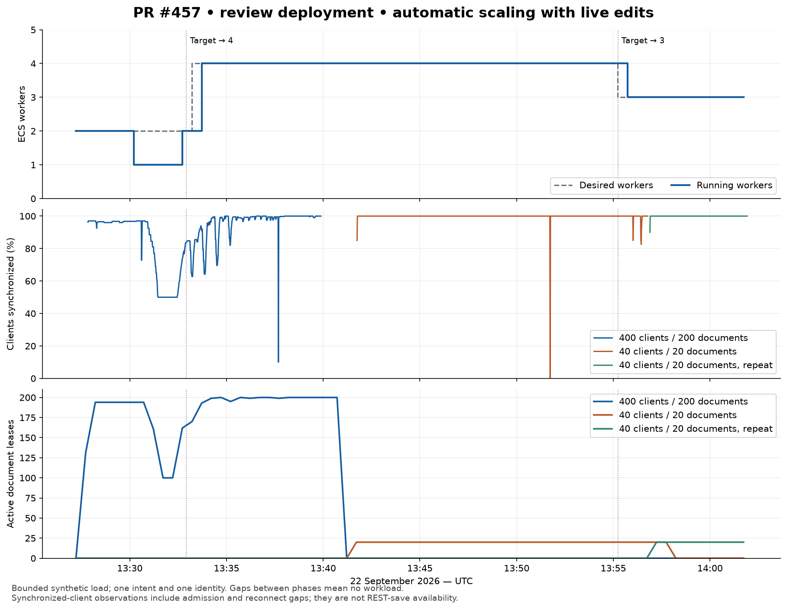

# Yjs review-environment validation — 2026-09-22

Validation of PR #457 in the isolated `review` deployment in `eu-central-1`.
The server runtime is commit `25f625486ef5cea26dd05e677ad98a520020ca2f`;
`verification.json` records its file hashes. This change adds the stronger load
oracle, recovery verifier, tests, and evidence. The load host runs Node 24.21.0;
the production image pins Node 24.15.0.

The deployed checks demonstrate eventual convergence, committed binary recovery,
fencing, and automatic scale-out and scale-in. They **do not establish seamless scaling or
production capacity**: the largest run exposed substantial synchronization gaps
and contention between documents sharing one intent.

## What the checks prove

Every generated edit has a unique writer/sequence key in an append-only CRDT
journal. The generator independently retains each key and timestamp. Every live
reader must match that journal's count and SHA-256 digest, all final writer
sequences, and the initial payload digest. Checking only the last value of each
writer would not detect missing intermediate edits.

Writes continue locally during disconnection. Cluster runs additionally require
durability receipts from every client. A separate AWS read retrieves the exact
S3 object version referenced by each committed DynamoDB manifest and compares it
with the independent expectation. Cold checks create empty clients, write
nothing, and provide no business-data or CRDT seed.

The synthetic connections use one disposable Cognito identity and a disposable
draft. Client counts are not counts of distinct authenticated people. No agent
workflow is started.

## Completed baseline measurements

Both baselines used 1024 CPU units and 2048 MiB per worker, 100 clients across 25
documents, 90 seconds of writing, one edit per client per second, and a 20 ms
connection ramp. The initial payload was empty.

| Check                                        | Result                                                                                           |
| -------------------------------------------- | ------------------------------------------------------------------------------------------------ |
| Standalone, one worker                       | 8,900 journaled edits; 100 readers converged; zero reconnects                                    |
| Cluster, one worker                          | 8,900 journaled edits; 100 readers converged; every durability receipt received; zero reconnects |
| Independent committed-version reads          | All 25 cluster snapshots matched all 8,900 edits                                                 |
| Fresh clients after expansion to two workers | All 25 rooms recovered; zero generated edits; every journal matched                              |

Raw results: `standalone-100.json`, `cluster-100.json`,
`cluster-100-snapshots.json`, and `cluster-cold.json`.
The earlier `cluster-cold.json` predates the correction that suppresses
historical-update age in cold checks; its propagation fields are not latency
evidence.

## Automatic scaling under load

The high-load phase ran from **13:27:41 to 13:39:52 UTC**, with 400 clients across
200 documents, a 64 KiB initial payload per document, one edit per client per
second, and a 20 ms connection ramp. Each worker had 1024 CPU units, 2048 MiB,
and a 100-document admission limit. Cluster mode and the unchanged target-tracking
policies were enabled with minimum two and maximum four workers.

CloudWatch's **capacity** high alarm triggered the desired count from **two to
four at 13:32:55 UTC**. Application Auto Scaling recorded successful completion at
13:34:01. This was an alarm-driven change; setting the initial minimum to two is
recorded separately and is not counted as automatic scale-out.

| Integrity result                           | Availability result                                                |
| ------------------------------------------ | ------------------------------------------------------------------ |
| 287,200 independently journaled edits      | 5,127 reconnect attempts                                           |
| 28,485 edits generated while disconnected  | 3,360 HTTP 503 upgrade responses                                   |
| All 400 readers converged                  | 90.091% observed synchronization availability                      |
| Every client received a durability receipt | Longest observed gap: 385.244 seconds, including initial admission |
| All 200 committed S3 versions matched      | Received-update p95/p99: 168/319 ms; excludes disconnected time    |

All documents share one intent's revocation guard. CloudWatch recorded 308
checkpoint transaction conflicts, 237 checkpoints rejected after lease expiry,
75 transaction-conflict renewal failures, and 15 conditional renewal failures
during this phase. These are log events, not unique failed edits. The existing
per-worker serialization does not eliminate contention between workers on that
shared guard. This workload therefore reveals an availability bottleneck even
though every generated edit was ultimately recovered.

ECS also replaced one normal worker after failed ELB health checks. Its container
exited normally with code 0, but the observed running count fell from two to one
between approximately 13:30:13 and 13:32:43, before automatic expansion. The run
therefore includes an unplanned health replacement as well as rebalancing and
scope-token expiry; its availability statistics cannot isolate the cost of
scaling alone. See `autoscaling-stopped-tasks.json`.

The run crossed scope-token expiry with zero token-fetch failures. Close code
4401 contributed 376 reconnects, alongside 3,552 code-1006 and 1,199 code-1012
closures. Reconnect counts include failed admission attempts; they are not a
count of distinct affected clients.

The low-load phase kept **40 clients editing 20 documents for 900 seconds**,
starting at 13:41:44 UTC, with 4 KiB initial payloads. The capacity low alarm
executed its action at 13:49:14; the scaling activity reduced the desired count
from **four to three at 13:55:14**, successfully fulfilling it at 13:55:45. The
removed normal worker exited with **code 0 at 13:57:00**.

All **35,920 edits**, including **63 generated offline**, matched all 20 committed
snapshots; all 40 readers converged and received durability receipts. Polling
observed six document owners change from the removed task to surviving tasks.
There were **71 reconnect attempts**, **10 rejected upgrades**, **99.871%
synchronization availability**, and a longest observed gap of **3.530 seconds**.
Forty code-4401 closures occurred at token expiry before scale-in; the remaining
closures were 19 code-1006 and 12 code-1012 events. These counts cover the entire
phase rather than isolating drain-related events.

This verifies an actual automatic reduction to three workers. It does not claim
that the controller reached its configured minimum of two during this phase.
See `scale-in-live.json`, `scale-in-live-snapshots.json`,
`scale-in-stopped-task.json`, and the alarm/action records.

A subsequent five-minute repeat on three workers admitted 40 fresh clients into
20 new documents. All **11,960 edits** converged and matched committed versions,
with every durability receipt, **zero reconnects**, and **zero offline writes**.
See `scale-in-tail.json` and `scale-in-tail-snapshots.json`.



`autoscaling.json` contains the independent expectations and per-client gaps;
`autoscaling-snapshots.json` contains exact committed object versions.
`scaling-activities.json`, `scaling-timeline.json`, `autoscaling-metrics.json`,
and `autoscaling-errors.json` provide AWS corroboration. The chart uses one-second
client observations and approximately thirty-second ECS/DynamoDB observations.
CloudWatch metric samples are at one-minute resolution. Do not interpret summed
metric samples as distinct documents or forwarded sockets as distinct users.

## One hot document

At the same 1024/2048 worker size, 100 clients edited one document for 90 seconds.
All **8,900 edits** converged, every client received a durability receipt, the
committed snapshot matched, and there were **zero reconnects**. Received-update
p95/p99 was **444/896 ms**, across 881,100 observations.

This checks bounded fan-out on one owner; it does not demonstrate that a single
document can use the combined CPU of multiple workers.
See `hot-100.json` and `hot-100-snapshots.json`.

## Abrupt owner death and recovery without a client seed

A temporary ECS task definition retained the production image and configuration
and wrapped `node server.js` in a shell that sends **SIGKILL** to Node on TERM.
The selected owner actually exited with **code 137**. This prevents application
drain/checkpoint handling, but ECS still performs its normal load-balancer
deregistration before stopping the container; this is not instantaneous loss of
the underlying host or network.

A separate document was checkpointed, and **every client and local Y.Doc for it
was destroyed before the owner was stopped**. A fresh empty client then recovered
the exact marker on a different owner with a different fencing token. The
manifest still referenced the same committed S3 version. This demonstrates
recovery from storage, independent of surviving-client replay.

In parallel, 100 clients across 25 documents generated **47,800 edits**, including
**4,744 while disconnected**. All readers, durability receipts, and 25 committed
snapshots matched. There were **554 reconnects** and a longest observed gap of
**60.811 seconds**. See `abrupt-fault.json`, `abrupt-load.json`,
`abrupt-snapshots.json`, and `fault-task.json`.

## AWS storage failures

S3 write and read faults used temporary explicit denies on the Yjs task role,
restricted to one disposable document's snapshot prefix.

- Denying `PutObject` closed the explicit flush without a durability receipt.
  The manifest sequence stayed unchanged. Restoring access allowed retained
  edits to commit.
- After the room became idle and its owner released it, denying `GetObject` and
  `GetObjectVersion` made a fresh client's upgrade fail with HTTP 503. Restoring
  reads recovered the exact saved content.
- Both temporary S3 policies were removed.

DynamoDB identity-policy attempts did not produce an observed denial and are
excluded from the fault claims. A subsequent 60-second table resource policy,
restricted to the review Yjs role, produced explicit resource-policy denials in
CloudWatch. The membership table remained accessible.

The DynamoDB workload generated **11,960 edits**, including **3,970 while
disconnected**. All 20 clients eventually converged, received durability receipts,
and matched committed snapshots. The replacement lease had a new fencing token;
renew, save, and release attempts using the old lease were all rejected.

This was a substantial availability disruption: **394 reconnects**, a longest
observed synchronization gap of **155.690 seconds**, and an aggregate
`syncAvailability` of **57.955%** over the observed run. Denied requests continued
after policy removal. The load's 300-second writing phase needed approximately
116 additional seconds to settle. Recovery finished before a subsequent manual
worker-replacement request; that replacement was not needed to obtain the
successful result.

These are injected authorization failures, not a regional AWS outage or a
measurement of normal storage latency. Control-plane policy removal was not
treated as proof that data-plane access had already recovered.

## Deployed browser behavior

Two isolated browser tabs used the deployed frontend and the same disposable
Cognito identity. Both directions synchronized. Each local edit caused exactly
one REST PATCH, for **two total**, without a duplicate save triggered by the
remote change. The persisted DRAFT prompt contained both markers, a fresh reopen
recovered them, and there were no browser JavaScript errors.

`browser-proof.json` and `browser-proof.png` record this check. The earlier attempt
during the storage fault synchronized locally but did not complete REST saves;
`browser-during-storage-fault.json` retains that failure. The successful repeat
does not establish REST-save availability during an outage.

## Deployment scope

The frontend was deployed using `scripts/deploy-frontend.sh review`. Backend
applies used saved plans through `scripts/deploy-terraform.sh review`, after
checking that mutations were restricted to `module.yjs_server`.

The full-stack plan proposed unrelated removals, including managed-environment
IAM roles and an AgentCore image, and was not applied. A temporary local Terraform
override removed only the build-order dependency on AgentCore while building Yjs
alone. It does not change the server runtime. Full-stack reconciliation is not
claimed.
Read-only AWS queries used the configured `solution-read` profile; the supplied
underscore spelling `solution_read` was not present locally.

## Final state and cleanup

Review was restored to **one healthy normal cluster worker**, task definition
revision 6, at its original **256 CPU units / 512 MiB**. The manual minimum and
maximum are both one, with no automatic scaling policies. All four Yjs operational
alarms were OK at the final readback. The local review variables retain cluster
mode so binary recovery remains available.

On this replacement worker, 25 fresh empty clients recovered the earlier
one-worker cluster baseline: all journals matched, every durability receipt
arrived, and there were zero generated edits, reconnects, or propagation samples.
See `final-cold.json` and `final-environment.json`.

The disposable DRAFT project/intent was deleted through the owner API (HTTP 204),
then absent from the project list and inaccessible through the project/intent
endpoints (HTTP 403). The temporary Cognito account was globally signed out and
deleted; `AdminGetUser` confirmed its absence. Temporary fault policies were
confirmed absent, fault task definition revision 4 was deregistered, the local
Terraform override and credential files were removed, and the collector stopped.

**The scoped rollout did not deploy the API changes.** The existing API's deletion
did not write the new Yjs revocation markers, as the first cleanup readback shows.
The two markers were therefore written explicitly for this disposable fixture
and verified afterward. This is cleanup, **not verification of the PR's
end-to-end parent-deletion path**; that path still needs the API rollout.

Binary data was retained under the documented retention behavior: **396 object
versions, 34,395,159 bytes**, and **309 intent-associated metadata rows**, including
its revocation marker, plus the project revocation marker. This is not a permanent
purge test. See `cleanup.json`, `retention-before-manual-revocation.json`, and
`retention.json`. No customer project or account was used for the workload.

## Automated checks

- Backend Yjs/intents/projects: **534 tests in 12 files**, including real
  WebSockets, DynamoDB Local, and Gremlin.
- Frontend: **550 tests in 79 files**.
- Terraform: validation passed and **six mocked configuration tests passed**.
- Release tooling: **53 tests passed**.

Added regression checks cover disconnected editing and independent journals,
fresh recovery without writes, standalone durability rejection, withholding
receipts on failed checkpoints, and failing cold joins closed when reads fail.
The journal oracle also rejects modified entries and same-length payload
corruption. Snapshot verification refuses manifests without a committed object
version. Terraform coverage now explicitly rejects autoscaling with a minimum
of one worker.

## Repeating the measurements

Use the commands in [Yjs operations](../../yjs-operations.md) with a disposable
intent and a Cognito ID token valid for the full run. The high-load settings were:

```bash
YJS_LOAD_CLIENTS=400 YJS_LOAD_DOCUMENTS=200 YJS_LOAD_SECONDS=720 \
YJS_LOAD_INITIAL_BYTES=65536 YJS_LOAD_UPDATE_MS=1000 YJS_LOAD_RAMP_MS=20 \
YJS_LOAD_REQUIRE_DURABILITY=true node lambda/yjs-server/load.js > run.json
node lambda/yjs-server/verify-snapshots.js run.json > snapshots.json
```

Set the URL, project/intent IDs, JWT, AWS profile/region, and storage names as
documented there. This experiment called the same exported `runLoad` function
through a local wrapper to persist its `onProgress` callback every second and
coalesce concurrent scope-token refreshes. It allowed 120 seconds to settle
after writing; the CLI default is 60 seconds. Keep these differences in mind
when reproducing fault workloads.

For the faults, deny writes/reads only to a test document's S3 prefix, record the
manifest before and after the failed flush, then remove the policy and verify
recovery. A cold read requires all clients closed and the owner released first.
The DynamoDB experiment denied access to the review document table only for the
Yjs task role; retain confirmed data-plane denials and cleanup readbacks rather
than assuming a successful policy update proves the fault. `ddb-resource-fault.json`
records the exact policy shape and installation/removal times.

For abrupt death, `fault-task.json` records the temporary command. Record the
actual exit code and committed version, not just a successful ECS stop request.
Restore the normal task definition before normal drain/scale-in measurements.
Do not run these fault procedures against an active shared deployment.

Account identifiers and private owner addresses are removed from public
artifacts; lease tokens are represented by SHA-256 hashes so equality and
replacement remain checkable. Snapshot/version IDs, synthetic document IDs,
timestamps, task IDs, and measurement values are retained. No Cognito credentials
or browser authentication state are included.

## Interpretation limits

These are bounded synthetic experiments from one client host, not production
capacity guarantees or attribution of the original customer's incident.
Horizontal scaling distributes documents; one hot document still has one owner.
Received-update propagation latency does not measure disconnected time.
`syncAvailability` includes initial joins and observed reconnect gaps, but cannot
detect transport loss before the client notices it.

Binary durability does not replace REST autosave semantics. Unacknowledged edits
still depend on a surviving owner or client during storage failures.

Before claiming production readiness, address or bound shared-intent transaction
contention, repeat across multiple independent intents and client hosts, and
measure the customer's document shapes and required availability. The evidence
does not justify choosing a production user limit from these synthetic counts.
