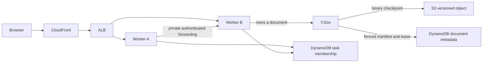

# Yjs operations

Yjs supports a standalone worker and an opt-in cluster that distributes documents
across ECS tasks. A document has one owner. Adding workers increases capacity for
many documents; it does not divide the CPU or fan-out cost of one busy document.
Use the load workload below to distinguish those cases before setting capacity.

Deployed measurements, fault results, and availability limitations are recorded
in the [2026-09-23 hardening validation](evidence/pr457-hardening-2026-09-23/README.md),
including the requested 400-client, 40-document workload. The
[2026-09-22 review validation](evidence/pr457-review-2026-09-22/README.md) remains
available as the earlier baseline.

## Configuration

Set `yjs_scaling` in the environment's Terraform variables. Production defaults to
one worker with 1024 CPU units and 2048 MiB, increased from 512/1024. Other
environments retain 256/512. To retain the previous production allocation, set
`cpu = 512` and `memory = 1024` explicitly.

Standalone vertical sizing:

```hcl
yjs_scaling = {
  cpu    = 1024
  memory = 4096
}
```

Manual horizontal sizing, after enabling cluster mode with one worker:

```hcl
yjs_scaling = {
  cluster_enabled = true
  cpu             = 1024
  memory          = 2048
  desired_count   = 4
}
```

Automatic horizontal sizing:

```hcl
yjs_scaling = {
  cluster_enabled = true
  cpu             = 1024
  memory          = 2048
  autoscaling = {
    min_capacity = 2
    max_capacity = 8
  }
  # Optional existing SNS topic ARNs for capacity/error alarms:
  # alarm_actions = ["arn:aws:sns:REGION:ACCOUNT:TOPIC"]
}
```

Terraform rejects multiple standalone workers, invalid Fargate CPU/memory pairs,
and invalid limits. `desired_count` applies in manual mode. The scalable target
uses identical minimum and maximum bounds for a manual count; updating those
bounds updates the service count. In automatic mode, Terraform ignores ECS's
changing desired count and maintains the configured bounds. Do not manage the
count independently in the console while expecting Terraform to restore it on
an otherwise unchanged apply.

Automatic policies target service CPU, service memory, and average worker
capacity utilization. Capacity is the largest fraction of the connection,
document-count, and total-document-byte budgets. Targets are 60% CPU, 70% memory,
and 60% capacity, with 60-second scale-out and 600-second scale-in cooldowns.
The CPU target accounts for a single Node event loop when allocating more than
one vCPU. These are initial settings, not measured customer capacity guarantees.
A skewed workload or one hot document can still saturate an individual owner;
the maximum-worker alarms must be monitored even when fleet averages are low.

Worker limits, also configurable inside `yjs_scaling`:

| Setting                    |  Default | Meaning                                                                         |
| -------------------------- | -------: | ------------------------------------------------------------------------------- |
| `max_connections`          |     2000 | Incoming sockets and pending upgrades per task, including forwarded connections |
| `max_documents`            |      256 | Loaded/loading documents and ownership admission per task                       |
| `max_document_bytes`       |  8388608 | Conservative encoded document budget, 8 MiB                                     |
| `max_total_document_bytes` | 67108864 | Total encoded document budget, 64 MiB                                           |
| `max_buffered_bytes`       | 16777216 | Maximum queued bytes per socket, 16 MiB                                         |

Encoded document size is not heap size. The server also rejects updates/loads
above 85% of configured task RSS capacity. Leave memory headroom and measure the
actual document structures, sizes, and edit patterns. A slow consumer is closed
with code 1013 and must reconnect/resynchronize; updates are not silently dropped.

## Ownership and durability



Workers register their private ECS task address with a 30-second membership
expiry and refresh every ten seconds. Rendezvous hashing chooses a preferred
owner. An existing document lease takes precedence until it is safely released
or expires. The ALB may connect a browser to any task; that task forwards the
WebSocket to the owner, which independently verifies the Cognito and scope
tokens. Forwarding is restricted to private IPv4 addresses and a single hop.
Neither browser redirects nor ALB stickiness establish document ownership.

Document leases carry a unique fencing token. Claims transactionally check the
parent scope revocation marker. Renewals and checkpoint commits conditionally
update only their document, checking its fencing token, deadline, and deletion
marker. Deletion blocks new claims first, then fences every existing document.
Workers stop accepting document messages five seconds before their local lease
deadline. This assumes normally synchronized ECS task clocks.

Claims in one intent share a revocation guard. Each worker bounds the scope claim
queue to 32 entries and five seconds, with bounded retries for transient conflicts.
Renewals run with 16 independent consumers, earliest deadline first; membership
heartbeats and transfers have separate single-flight lanes. Slow persistence does
not prevent membership refresh. A temporary renewal failure retains only the last
confirmed lease deadline; a failed fencing condition immediately stops serving
the document. Unowned documents are placed only on members advertising capacity,
with local slots reserved before asynchronous claims. Existing leases remain
authoritative; rebalancing skips full destinations.

Dirty documents checkpoint at most once per two-second interval. Concurrent
explicit flushes share the checkpoint. S3 holds the binary Yjs update, while a
conditional DynamoDB update commits its exact object/version and sequence.
An uncertain write response never causes deletion of an object that might have
committed. The sequence condition prevents a delayed checkpoint from replacing
a newer one. Recovery loads the committed version before the initial handshake.

The normal checkpoint interval is **not** a guaranteed recovery-point objective:
upload latency, retries, and a storage outage can extend it. A receipt confirms
durability through the revision requested on that connection. Changes newer than
the last successful checkpoint rely on surviving browsers resynchronizing; if
the owner and all those browsers disappear, uncommitted edits can be lost.

Browser business-data autosaves run only for local changes, with a two-second
debounce, ten-second maximum wait, serialized saves, and retries. In cluster mode
they wait for a checkpoint receipt before writing the REST representation.
Backend business records remain necessary for workflows and API reads. The client
reads the business revision before flushing, then snapshots the current CRDT and
writes with that revision. Draft PATCH requires `ifDraftRevision`; artifact PUT
requires `ifEditRevision` and `collaborationEpoch`. Missing preconditions return
428; a competing write returns 409 `edit_conflict`. The client retries at most
three times, repeating revision read, checkpoint, and current-document capture.
Artifact replacement returns `artifact_replaced` and requires reloading the editor.
Other draft writers also advance the revision. API integrations must supply the
new preconditions; deploy the API and frontend together and reload older clients.
Explicit Start actions also save remote or recovered content when the local
browser has no dirty revision. Passive autosaves and navigation still avoid
writing solely because a peer changed the document. Artifact editing reports
failures from the revision read, checkpoint barrier, and business write.

SPA navigation flushes registered autosaves before closing that document's socket
and destroying its CRDT, with a 30-second lifetime bound. This does not guarantee
saving during process death, browser termination, or a full page unload. Browser
IndexedDB persistence is not implemented: losing every replica before a durable
receipt can still lose recent edits.

Agent/Quorum replacement of an artifact rotates its collaboration epoch. A new
editor then seeds a new document from the replacement content. Human autosaves
retain the epoch, and the content API rejects an editor carrying an older epoch.
This prevents recovery from reintroducing a previous generated artifact.

Idle owners checkpoint and release documents after sixty seconds. During
membership changes, a worker transfers at most four documents per heartbeat:
freeze messages, checkpoint, release, and close sockets with 1012. Clients keep
their local CRDT, reconnect with jitter, and merge with the successor. Existing
WebSockets do not move merely because the ECS count changes.

SIGTERM starts a drain and stops new upgrades. Lease renewals continue while
documents checkpoint in bounded batches. The application allows 90 seconds;
ECS's stop timeout is 120 seconds. An abrupt task loss requires lease expiry
plus reconnection/backoff before another owner can recover the document.

## Enable, expand, and roll back

Use an isolated deployment first. No deployment or load against a customer
environment is implied by running the unit tests.

1. Deploy the new backend and frontend while retaining one standalone worker.
   Reload active browsers so they use the corrected awareness protocol and
   artifact document identities. The single-worker deployment stops the old
   task before starting the replacement and briefly interrupts collaboration.
   Terraform explicitly disables ECS Availability Zone Rebalancing in the same
   service update. Existing installations may have it enabled; ECS otherwise
   retains that setting and rejects the required `maximumPercent = 100`.
2. During a maintenance window, let editors save and close them. Set
   `cluster_enabled = true` and `mode_transition = true`, **keep
   `desired_count = 1`**, and leave automatic scaling unset. Deploy and wait for the service to stabilize. The old
   standalone worker has no binary checkpoints; REST data and surviving browser
   CRDTs provide the initial state for the cluster.
3. Verify health, editing, persisted recovery after all browsers disconnect, and
   the absence of checkpoint errors. Set `mode_transition = false`, then increase the manual count to two/four.
   Do not combine the initial mode transition with an increase in worker count:
   overlapping standalone and clustered workers would own independent state.
4. Exercise growth and shrinkage, abrupt owner termination, continuous editing,
   reconnects, and storage errors in the isolated environment. Confirm recovery
   and resource headroom. Enable automatic policies only after those checks.

Normal clustered deployments use ECS minimum healthy 100%, maximum 200%, and AZ
rebalancing. Reserve enough quota/subnet capacity to start replacement tasks before
old tasks drain. Only standalone operation and explicit `mode_transition = true`
use stop-before-start 0/100. Remove the transition flag after the migration.
Previous task definitions remain registered, and ECR retains the last 30 images;
roll back within that retention window. Frontend deploys retain existing hashed
assets so already open tabs can still load lazy chunks; remove old assets only
through a separately defined retention policy that covers active client lifetimes.

For rollback, remove automatic policies and set a fixed manual count while
keeping cluster mode enabled. Scale back to one owner if necessary. Keep the
membership table, manifests, and S3 snapshots. Returning to standalone mode or
deploying the old server is a maintenance operation: finish business saves,
close clients, wait for drains, and explicitly account for drafts that exist
only in the binary checkpoints. Standalone mode does not read those checkpoints.

The deploy role needs permission to manage Application Auto Scaling and, on
first use, its ECS service-linked role. The task role receives only the document
table operations, membership operations, and `yjs-documents/*` S3 operations it
needs. The task security group admits forwarding from itself on port 1234.

## Metrics and incident checks

`terraform output -json yjs_scaling` shows effective sizing and the CloudWatch
`ServiceName` dimension. The namespace is `CollaborativeAI/Yjs`; each task emits
metrics every thirty seconds through its existing log group.

| Signal                                                          | What to check                                                          |
| --------------------------------------------------------------- | ---------------------------------------------------------------------- |
| `EventLoopDelayP99Ms`, ECS CPU                                  | One busy document, many updates, initial sync bursts, serialization    |
| `ResidentMemoryBytes`, ECS memory, `DocumentBytes`, `Documents` | Heap growth, document size/history, idle eviction, skew between owners |
| `QueuedBytes`, `Connections`, `ProxiedConnections`              | Slow consumers, connection distribution, forwarding cost               |
| `Updates`, `UpdateBytes`                                        | Actual editing rate and payload size; compare with user/room counts    |
| `NotReady`                                                      | Cluster membership readiness; `/readyz` returns 503 while unavailable  |
| `PersistenceErrors`                                             | IAM/network errors, S3 latency, DynamoDB throttling or lease conflicts |
| `RejectedConnections`, `CapacityUtilization`                    | Worker admission limits and fleet headroom                             |

`/livez` and the compatibility `/healthz` endpoint report process liveness; ALB
and the explicitly configured ECS container health check use liveness.
ECS ignores a health check declared only in the Docker image. `/readyz` reports cluster readiness.
Storage failures reject affected joins/flushes and increment persistence errors.
Membership failures also set `NotReady`. ECS does not repeatedly replace otherwise
live workers during a dependency outage. Recovery is bounded by the last
confirmed lease and dependency recovery, not by a promised fixed outage duration.

Alarms cover readiness, maximum worker capacity, maximum event-loop delay, persistence
failures, and rejected connections. Notifications require `alarm_actions`.
Inspect DynamoDB throttle reasons, request latency, and the configured billing
mode separately. The repository uses on-demand tables; this does not prove that
a particular customer deployment applied that configuration or has no hot key,
quota, or throttling problem.

## Deletion and snapshot retention

Deleting an intent, project, or legacy sprint first writes a permanent scope
tombstone. A strongly consistent scan fences all matching documents, including
arbitrary artifact ids, epochs, and legacy names, before deleting their metadata.
The marker stores a compare-and-swap scan cursor so a timed-out deletion resumes
instead of rescanning from the beginning. An incomplete API deletion returns 409 `deletion_pending`; retry it shortly.
The business cascade proceeds after document fencing succeeds.

The deletion path removes every S3 object version and delete marker under that
scope. A scheduled Lambda revisits due tombstones through the sparse `cleanup`
index every minute (at most 20 per invocation), then hourly, to remove uploads
that completed late or had uncertain responses. Keep scope tombstones permanently;
the document namespace must never be reused. Large deletion backlogs take multiple
invocations and need operational monitoring; this is not instantaneous erasure.

Existing tombstones need a one-time index backfill. Inspect the dry run, then apply:

```bash
YJS_DOCUMENTS_TABLE=your-table node scripts/backfill-yjs-deletion-cleanup.mjs
YJS_DOCUMENTS_TABLE=your-table node scripts/backfill-yjs-deletion-cleanup.mjs --apply
```

Provision N+1 capacity for worker loss and deployments. Autoscaling reacts after
metrics and task startup; it is not a substitute for spare capacity. A 400-client
single-intent test does not qualify thousands of tenants, regional failure,
long-term CRDT history growth, or a single enormous hot document.

## Reproducible validation

Use Node 24 (the production image's major version). Install the root and
standalone server dependencies:

```bash
npm ci
npm ci --prefix lambda/yjs-server --ignore-scripts
npm --prefix lambda/yjs-server test
```

The standalone suite exercises real local WebSockets, concurrent joins,
awareness ownership, resource rejection, task forwarding, checkpoint failures,
and repeated 1 → 2 → 4 → 2 membership changes. With Docker available, the root
runner also starts DynamoDB Local and Gremlin:

```bash
npm test -- --project yjs-server --project intents --project projects
npm --prefix frontend test
```

Terraform's `tests/yjs.tftest.hcl` uses mock providers to verify standalone,
manual, and automatic settings and reject unsafe configurations. The Terraform
CI workflow uses a temporary local backend so these checks need no AWS account.

For deployment measurements, create a disposable test intent, supply its project
and intent IDs, and use a Cognito ID token that remains valid for the run. Set
the token through your local secret-handling mechanism; do not commit it:

```bash
export YJS_LOAD_URL=https://your-test-application.example
export YJS_LOAD_PROJECT_ID=00000000-0000-4000-8000-000000000001
export YJS_LOAD_INTENT_ID=00000000-0000-4000-8000-000000000002
# Set YJS_LOAD_JWT securely in the environment.
YJS_LOAD_CLIENTS=100 YJS_LOAD_DOCUMENTS=25 YJS_LOAD_SECONDS=180 \
  node lambda/yjs-server/load.js
```

The workload uses isolated review-room names, refreshes scope tokens, edits
unique writer keys, and sends presence updates. Each generated edit also enters
an append-only CRDT journal. An independent journal in the load process supplies
the expected entry count and SHA-256 digest; every reader must match it, the
writer sequences, and the initial payload. This detects missing intermediate
edits even when the final writer values match.

Edits continue in the local CRDT while a client is disconnected. Results include
`offlineWrites`, rejected upgrade status codes, reconnect/close counts, and each
client's time awaiting synchronization. `syncAvailability` includes initial joins
and observed reconnect gaps. It does not detect a broken connection before the
transport notices it, nor prove that another peer received every edit immediately.
Propagation p95/p99 covers received updates only and is capped at the first
1,000,000 observations. Neither statistic measures REST autosave availability.

Set `YJS_LOAD_REQUIRE_DURABILITY=true` to require a checkpoint receipt from every
writer before the run succeeds. Save the JSON result, then independently inspect
the exact object versions referenced by the committed manifests:

```bash
YJS_LOAD_REQUIRE_DURABILITY=true node lambda/yjs-server/load.js > run.json

# Use the deployment's table/bucket names and an AWS profile with read access.
export YJS_DOCUMENTS_TABLE=your-yjs-documents-table
export YJS_MEMBERS_TABLE=your-yjs-members-table
export YJS_SNAPSHOTS_BUCKET=your-artifacts-bucket
node lambda/yjs-server/verify-snapshots.js run.json > snapshots.json
```

For a cold recovery check, wait until the load process has exited, replace the
owner (or wait for idle eviction), and run:

```bash
YJS_LOAD_EXPECTED_FILE=run.json YJS_LOAD_REQUIRE_DURABILITY=true \
  node lambda/yjs-server/load.js > recovery.json
```

Recovery creates one empty client per room, generates no edits, and applies no
initial payload or business-data seed. It checks the same independent journal.
Record the old/new task IDs and whether shutdown was graceful or abrupt; reading
a checkpoint or opening another client on a live owner alone is not cold recovery.

Repeat with many rooms and with `YJS_LOAD_DOCUMENTS=1`, larger
`YJS_LOAD_INITIAL_BYTES`, bursty joins (`YJS_LOAD_RAMP_MS=0`), and higher edit
rates (`YJS_LOAD_UPDATE_MS`). Observe task metrics and DynamoDB/S3 requests while
changing the worker count. Run a longer idle phase to observe automatic scale-in.
Record deployment size, users per document, bytes per document, edit frequency,
latency/error targets, and results before choosing production limits.

## Retention

Deleting an intent/project writes a revocation marker that fences future leases
and checkpoints (active ownership notices on renewal). Existing deletion code
still removes its known metadata rows. **The new binary snapshots are retained;
this change does not add permanent snapshot purge to parent deletion.** Do not
remove the revocation markers while old scope tokens or clients might exist.
Snapshot retention and permanent deletion require an explicit operational policy
before enabling cluster mode for data that must be erased with its parent.

Successful checkpoints remove their previous committed object version.
Ambiguous writes, process death between upload and commit, failed cleanup, and
old artifact epochs can leave additional objects. Do not attach a blanket S3
age-based expiration rule: it could delete a still-authoritative idle document.
Inventory and garbage collection must check the manifest/ownership state and
revoked scopes, including uploads that were in flight when deletion began.
