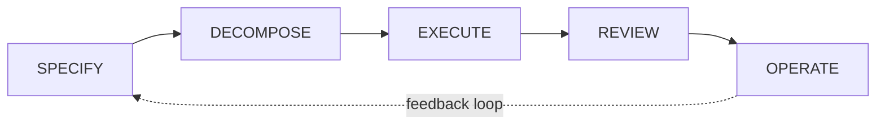

# AIDLC Collaborative

AIDLC Collaborative is an opinionated implementation of the [AI-DLC methodology](https://github.com/awslabs/aidlc-workflows): a platform where humans and AI agents collaborate on software development through a shared, structured workflow.

You define what you want built. AI agents plan, implement, and review it. Everything (requirements, design decisions, tasks, code) is connected in a graph so nothing gets lost between intent and implementation.

The platform implements a five-stage pipeline that mirrors how teams naturally move from idea to production:

## How it works

In the **Specify** stage, teams write specs together in a real-time collaborative editor with LLM assistance. Multiple users can edit the same document simultaneously with conflict-free resolution using CRDTs.

In the **Decompose** stage, the system breaks specs into a dependency graph of implementation tasks. Each task has complexity estimates, acceptance criteria, and explicit dependencies on other tasks.

In the **Execute** stage, AI agents pick up tasks and code in isolated git worktrees. An orchestrator dispatches independent tasks to parallel agents, and tasks that depend on others wait until their dependencies complete.

In the **Review** stage, humans review agent output with structured acceptance criteria. The review agent evaluates code against the original requirements, not just code quality.

In the **Operate** stage, monitoring and feedback flow back into new specs, closing the loop.

## Key features

- **Real-time collaboration** on specs with multiple users editing simultaneously
- **LLM-assisted writing** through a chat panel that understands your codebase
- **Automatic task decomposition** with dependency graphs and complexity estimates
- **Autonomous agent execution** using Claude CLI in isolated git worktrees
- **Structured review** with accept/reject cycles and criteria-based evaluation
- **GitHub integration** for pushing tasks as issues and syncing status
- **Methodology templates** to standardize how specs are written across projects
- **Role-based access control** with organizations, projects, and fine-grained permissions

## Next steps

- [Getting Started](getting-started/prerequisites.md) to set up the platform
- [Concepts](concepts/index.md) to understand how the pipeline works
- [Using the Platform](using-the-platform/index.md) for day-to-day usage guides
