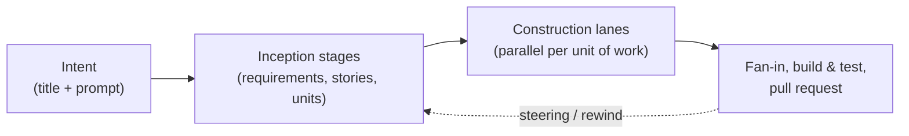

# AIDLC Collaborative

AIDLC Collaborative is an opinionated implementation of the [AI-DLC methodology](https://github.com/awslabs/aidlc-workflows): a platform where humans and AI agents collaborate on software development through a shared, structured workflow.

You describe what you want built as an **intent**. A workflow of AI agents plans, implements, and verifies it — pausing at human gates whenever a decision is yours to make. Everything (requirements, user stories, designs, decisions, code) is connected in a graph so nothing gets lost between intent and implementation.

## Founding principles

This platform is built on a set of principles that survive tool changes and technology shifts. Regardless of which LLM or which IDE becomes dominant, these fundamentals remain:

- **Structured data over raw context.** Instead of relying on massive context windows and attention mechanisms across 200k+ tokens, we use structured databases (graph, NoSQL) to maintain explicit links between requirements, human/agent interactions, code files, and decisions. This gives agents bounded, relevant context rather than forcing them to search entire codebases.
- **Traceability by design.** Every artifact (requirement, user story, design decision, code change) is tracked in a graph database. You can trace from a business requirement down to the exact code that implements it, and back. Stage status, ownership, and history are always visible.
- **Human observability at every stage.** Humans approve, redirect, or refine at natural breakpoints — human gates, stage reviews, and course corrections. The key idea: abstract away the noise of each agent's raw output and surface only the high-level, business-relevant information. This prevents cognitive overload for the human reviewer — their "context window" (brain) is limited too.
- **Real-time collaboration, multi-agent.** Most AI coding tools today are local, individual, and excellent for personal productivity. But they hit a wall in enterprise contexts: data stays local, syncing config files and skills is manual, and there is no shared state. This platform is collaborative-first, with multiple agents and humans working in the same structured workspace simultaneously.
- **Tool-agnostic architecture.** We take what works best for each module. The platform integrates proven, adopted tools (GitHub, GitLab, Claude Code, OpenCode, Kiro) rather than locking into a single vendor. The important thing is the _concept_ at each layer — structured data, traceability, collaboration, observability — not the specific implementation. See [Concepts](concepts/index.md) for details on technology choices and alternatives.

## The lifecycle

Work is organized around **intents**. An intent is a title and a prompt — a feature, a bugfix, a whole greenfield system — scoped to a project. Starting an intent executes a **workflow**: an ordered plan of stages, grouped into phases, that carries the work from idea to a reviewable pull request.

Each stage runs a headless agent CLI in an isolated **Amazon Bedrock AgentCore** session. Three orthogonal safety nets verify every stage: deterministic **sensors**, an LLM **reviewer** agent, and **human validation gates**. Construction fans out into parallel lanes — one per unit of work from the methodology's own dependency graph — and the engine merges completed lanes back deterministically.

The workflow itself is data, not code: it is composed from a library of **building blocks** (stages, agent personas, rules, sensors, scopes, and more) seeded from the upstream AI-DLC methodology. Platform administrators can fork blocks and compose custom workflows in the visual composer.

## How it works

1. **Create an intent.** Write a prompt, or import a tracker issue (GitHub Issues, GitLab Issues, Jira Cloud). Pick a scope — feature, bugfix, greenfield — and optionally a base branch per repository.
2. **Start it.** A durable orchestrator compiles the pinned workflow into an execution plan and walks its stages. Agents write typed artifacts into the graph through MCP tools; the engine owns all git operations.
3. **Collaborate.** Answer the agents' clarifying questions, approve gates, discuss artifacts in threads, and steer the run with course corrections — all in real time.
4. **Observe.** Watch live progress on the intent workbench, drill into per-stage sensors, durations, token usage and cost on the observability page, and explore the traceability graph.
5. **Review.** On success the platform opens a pull request (GitHub) or merge request (GitLab) from the intent branch. Review the code alongside the intent's artifacts and metrics.

## Key features

- **Intent-driven development** — from a one-line prompt or a tracker issue to a reviewed pull request
- **Composable workflows** — a block library and visual composer to tailor the methodology per organization
- **Parallel construction** — deterministic fan-out into per-unit lanes with engine-owned merges
- **Human gates and steering** — clarifying questions, approval gates, course corrections, per-stage rewind
- **Serverless agent runtime** — isolated Bedrock AgentCore sessions per intent, durable orchestration, park/resume at zero compute
- **Deep observability** — live stage pipeline, sensors, durations, token usage and cost per stage, intent, and project
- **Graph-based traceability** — requirements, stories, components, decisions, and units of work as typed, linked items
- **Git and tracker integration** — GitHub and GitLab code hosts; GitHub Issues, GitLab Issues, and Jira Cloud trackers
- **Real-time collaboration** with presence, discussions, and live agent output

## Next steps

- [Getting Started](getting-started/prerequisites.md) to set up the platform
- [Your first intent](getting-started/first-intent.md) to run your first end-to-end workflow
- [How it works](concepts/index.md) to understand the lifecycle and principles
- [Architecture overview](concepts/architecture.md) for a system diagram of the components
- [Using the Platform](using-the-platform/projects.md) for day-to-day usage guides
