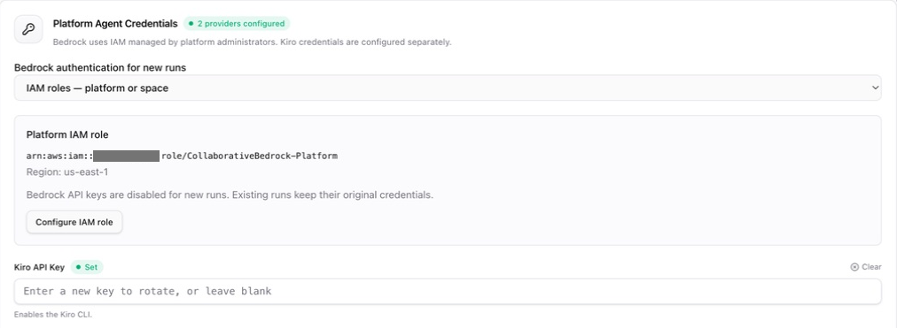
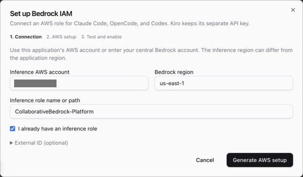
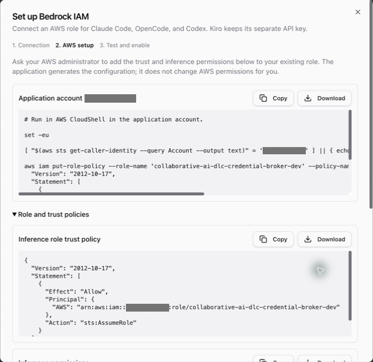
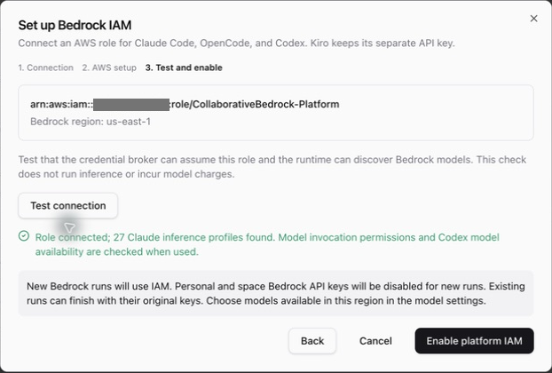
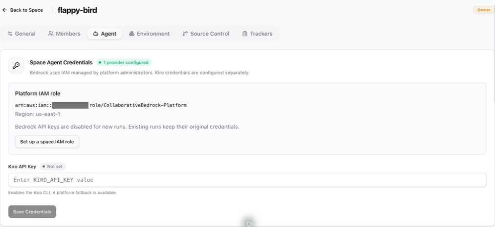
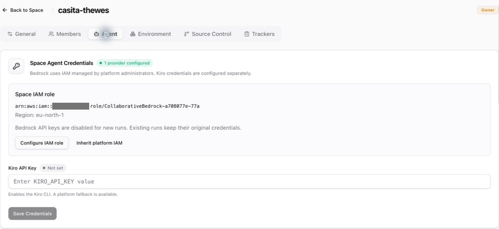
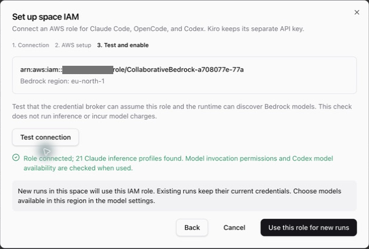

# Bedrock IAM setup

Platform administrators choose **API keys** or **IAM roles** in **Admin → Agents → Platform Agent Credentials**. IAM supports Claude Code, OpenCode, and Codex. Kiro continues to use its own API key.

| Scope    | In API-key mode       | In IAM mode                                                   |
| -------- | --------------------- | ------------------------------------------------------------- |
| Platform | Fallback Bedrock key  | Default inference role and region                             |
| Space    | Optional shared key   | Inherit platform IAM; platform admins may assign a space role |
| Personal | Optional personal key | Uses space/platform IAM; no personal role                     |

The mode applies to new runs, draft AI composition, and draft discussion assists. Existing intents keep their pinned authentication. Enabling IAM disables personal and space Bedrock keys for new runs and hides their key controls. It does not delete stored keys or interrupt existing key-based runs.

Screenshots show an example deployment. AWS account identifiers are redacted.

## Set up the platform

1. Deploy the updated application and runtime. Rebuild and publish managed environments from the updated base before assigning them to spaces that will use IAM.
2. In **Admin → Agents**, choose **IAM roles** under **Bedrock authentication for new runs**.
3. Enter the inference AWS account, region, and role name. The application account and region are filled in initially. You can instead use a central Bedrock account and a different region, within the same AWS partition.
4. The wizard generates commands for AWS CloudShell. Run the inference-account commands to create the dedicated role and its trust/inference policies, then the application-account commands to allow the credential broker to assume that exact role. For an existing role, select **I already have an inference role** and give its administrator the generated policies instead. Copy and download controls are available for every script and policy.
5. Choose **Test connection**. This checks role assumption and Bedrock model discovery from the agent runtime; it does not invoke models. IAM changes may need time to propagate before a retry succeeds.
6. Choose **Enable platform IAM**, then select models available in the inference region in the model settings. The target account must have access to those models.

The application generates setup documents but does not create or modify IAM resources itself. AWS administrators need permission to create the inference role and attach its policy in the target account, and to attach the generated assume-role policy to the credential broker role in the application account. These additional named policies can also be managed through the customer's infrastructure tooling.

The generated inference policy covers both Bedrock Runtime (Claude Code/OpenCode) and Bedrock Mantle (Codex). A successful connection check does not prove that every selected model can be invoked: model availability, marketplace entitlements, organization policies, and Mantle access still apply at inference time.

The credential broker must be able to reach STS. The runtime must be able to reach the broker and the relevant Bedrock endpoints. Use the connection check and your deployment's network configuration when setting up another region.

## Override IAM for a space

After platform IAM is enabled, a platform administrator with access to the space can select **Set up a space IAM role** in **Space Settings → Agent**. The same wizard configures and checks that space's account and region. **Inherit platform IAM** removes the override for future runs. Space owners and users cannot configure, verify, or clear IAM roles; the API enforces this independently of the UI.

A user cannot select their own IAM role or bypass platform IAM with a personal Bedrock key. Personal Kiro keys remain available.

The following spaces illustrate both choices: **flappy-bird** inherits the platform role in `us-east-1`; **casita-thewes** uses a space role in a different account and `eu-north-1`.

The successful checks above confirm role assumption and model discovery. They do not invoke models or validate every model's inference permissions.

## Long-running and paused sessions

Each invocation redeems a signed, five-minute handoff grant at the existing credential broker. The broker assumes only the role in that grant and returns temporary credentials plus renewal authorization restricted to that invocation and role. Renewal authorization cannot be used to retrieve API keys, switch roles, or extend its original eight-hour lifetime (the runtime's existing active-session limit).

The runtime supplies credentials through a local, authenticated AWS container-credential endpoint. The endpoint refreshes credentials before expiry and closes when the invocation's work ends, including background jobs. Credentials and renewal authorization remain in memory; neither is saved in execution state, session storage, or generated CLI configuration. Inference requests go directly from each CLI to Bedrock.

An hour-long credential session is not an hour-long stage limit. Renewal starts five minutes before expiry and retries transient failures every 30 seconds while the existing credentials remain valid. Successful renewal keeps the same CLI process and conversation running, including stages that generate code continuously for several hours.

If renewal has not succeeded by credential expiry, an independent watchdog cancels the invocation's agent processes. The runtime gives them a short graceful shutdown period, then force-stops their process group if necessary. It attempts the normal conversation persistence and Git checkpoint before reporting `bedrock_credentials_expired` through the existing durable stage callback. This does not depend on the CLI exiting on its own or printing a recognizable error. If the checkpoint also fails, the failure detail and timeline identify that generated work may remain only in the runtime workspace.

The separate eight-hour invocation authorization deadline reports `bedrock_authorization_expired`. Neither failure silently changes roles, falls back to API keys, or automatically restarts the agent. A retry receives fresh authorization. Other active invocations keep their own credentials and continue independently.

Continuous execution can renew credentials without restarting the agent. When an answer resumes a parked stage hours or days later, the orchestrator issues a new invocation grant and the broker issues fresh credentials and the runtime creates a new endpoint for the intent's pinned configuration. Existing conversation storage, recovery, and retention behavior is the same as for API-key runs; IAM does not introduce a shorter session lifetime.

The shared runtime has an explicit denial of direct `sts:AssumeRole`. The broker also restricts issued sessions to inference and model discovery, so a broadly configured target role cannot grant further role assumption through those credentials. Knowing another space's role ARN does not authorize its use. This protects credential selection; it does not create general isolation for all application data accessible to agent code.

The built-in MCP bridge retains the application runtime role for Neptune, DynamoDB, and other application resources. Selecting an inference role or region does not move that data access into the inference account.

Changing the platform mode or a configured role affects future runs. To revoke an existing IAM run's AWS access, revoke its role permissions or trust in AWS. Removing a role only from application settings does not change the binding already pinned to that run.

## Authentication configuration

API keys retain their existing SSM SecureString paths. IAM configuration is non-secret JSON:

- Platform: `/<project_name>/<environment>/bedrock-auth`, containing `mode` and `iam`.
- Space override: `/<project_name>/<environment>/projects/<project-id>/agent-credentials/bedrock-iam`.

An absent platform setting preserves API-key mode for existing deployments. Invalid configuration fails closed rather than enabling keys. The role ARN, region, and external ID are validated before being stored or used in generated shell commands.

For the underlying provider behavior, see [AWS container credentials](https://docs.aws.amazon.com/sdkref/latest/guide/feature-container-credentials.html), [Claude Code on Bedrock](https://code.claude.com/docs/en/amazon-bedrock), [OpenCode providers](https://opencode.ai/docs/providers/), and [Codex on Bedrock](https://developers.openai.com/codex/amazon-bedrock).
